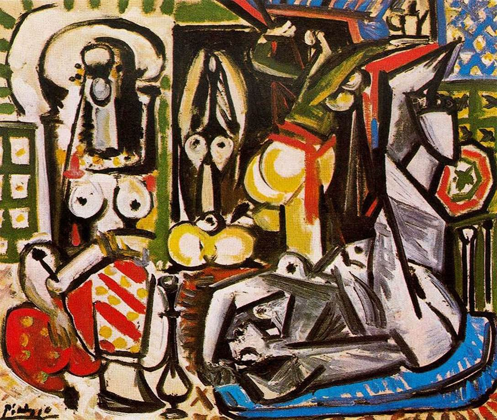

[🏠 Home](../../index.md)

# April 1

## 🧑‍🎨 Painting of the day

[Pablo Picasso](http://en.wikipedia.org/wiki/Pablo_Picasso) (Cubism)

<button class="btn btn-success"
onclick=" window.open('https://lens.google.com/uploadbyurl?url=https://iretes.github.io/one-a-day/data/img/Pablo_Picasso_8.jpg','_blank')">
Search with Google Lens
</button>

## 🎼 Song of the day

> *The Times They Are A-Changin*
by Bob Dylan

 Written by Dylan.

Released in Jan. , 1964.

<button class="btn btn-success"
onclick=" window.open('http://www.youtube.com/search?q=The Times They Are A-Changin by Bob Dylan','_blank')">
Search on YouTube
</button>

## 🏛️ UNESCO heritage site of the day

> *Historical Centre of the City of Yaroslavl*, Russian Federation

Situated at the confluence of the Volga and Kotorosl Rivers some 250 km north-east of Moscow, the historic city of Yaroslavl developed into a major commercial centre from the 11th century. It is renowned for its numerous 17th-century churches and is an outstanding example of the urban planning reform Empress Catherine the Great ordered for the whole of Russia in 1763. While keeping some of its significant historic structures, the town was renovated in the neoclassical style on a radial urban master plan. It has also kept elements from the 16th century in the Spassky Monastery, one of the oldest in the Upper Volga region, built on the site of a pagan temple in the late 12th century but reconstructed over time.

<button class="btn btn-success"
onclick=" window.open('http://www.google.com/search?q=Historical Centre of the City of Yaroslavl','_blank')">
Search on Google
</button>

## 🗺️ Place of the day

<iframe
src="https://www.mapcrunch.com"
name="mapcrunch"
width="500"
height="500"
allowTransparency="true"
scrolling="no"
frameborder="0"
>
</iframe>
## 🎨 Color of the day

> *[Yellow (NCS)](https://en.wikipedia.org/wiki/Shades_of_yellow#Yellow_(NCS)_(psychological_primary_yellow))*

&#9632;

## 🌿 Plant of the day

> *common yarrow*

<button class="btn btn-success"
onclick=" window.open('http://www.google.com/search?q=common yarrow','_blank')">
Search on Google
</button>

## 🧑‍🔬 Scientific discovery of the day

> *2022: On 13 December, the US Department of Energy announces that scientists at the National Ignition Facility have achieved the first positive energy gain from a fusion reactor in history.*

<button class="btn btn-success"
onclick=" window.open('http://www.google.com/search?q=2022: On 13 December, the US Department of Energy announces that scientists at the National Ignition Facility have achieved the first positive energy gain from a fusion reactor in history.','_blank')">
Search on Google
</button>

## 💭 Philosophical concept of the day

> *[Intrinsic and extrinsic properties](https://en.wikipedia.org/wiki/Intrinsic_and_extrinsic_properties_(philosophy))*

## 🗣️ Saying of the day

> *Toodle-oo*

A colloquial version of 'goodbye', now rather archaic. 
