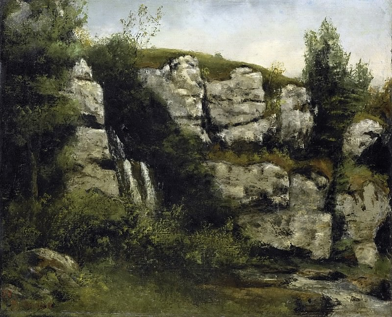

[🏠 Home](../../index.md)

# April 10

## 🧑‍🎨 Painting of the day

[Gustave Courbet](https://en.wikipedia.org/wiki/Gustave_Courbet) (Realism)

<button class="btn btn-success"
onclick=" window.open('https://lens.google.com/uploadbyurl?url=https://iretes.github.io/one-a-day/data/img/Gustave_Courbet_4.jpg','_blank')">
Search with Google Lens
</button>

## 🎼 Song of the day

> *Crazy*
by Gnarls Barkley

 Written by Brian Burton, Thomas Calloway, Gianfranco Reverberi, Gian Piero Reverberi.

Released in May , 1906.

<button class="btn btn-success"
onclick=" window.open('http://www.youtube.com/search?q=Crazy by Gnarls Barkley','_blank')">
Search on YouTube
</button>

## 🏛️ UNESCO heritage site of the day

> *Chitwan National Park*, Nepal

At the foot of the Himalayas, Chitwan is one of the few remaining undisturbed vestiges of the 'Terai' region, which formerly extended over the foothills of India and Nepal. It has a particularly rich flora and fauna. One of the last populations of single-horned Asiatic rhinoceros lives in the park, which is also one of the last refuges of the Bengal tiger.

<button class="btn btn-success"
onclick=" window.open('http://www.google.com/search?q=Chitwan National Park','_blank')">
Search on Google
</button>

## 🗺️ Place of the day

<iframe
src="https://www.mapcrunch.com"
name="mapcrunch"
width="500"
height="500"
allowTransparency="true"
scrolling="no"
frameborder="0"
>
</iframe>
## 🎨 Color of the day

> *[Golden brown](https://en.wikipedia.org/wiki/Gold_(color)#Golden_brown)*

&#9632;

## 🌿 Plant of the day

> *pokeweed*

<button class="btn btn-success"
onclick=" window.open('http://www.google.com/search?q=pokeweed','_blank')">
Search on Google
</button>

## 🧑‍🔬 Scientific discovery of the day

> *2005: Grid cells in the brain are discovered by Edvard Moser and May-Britt Moser.*

<button class="btn btn-success"
onclick=" window.open('http://www.google.com/search?q=2005: Grid cells in the brain are discovered by Edvard Moser and May-Britt Moser.','_blank')">
Search on Google
</button>

## 💭 Philosophical concept of the day

> *[Substantial form](https://en.wikipedia.org/wiki/Substantial_form)*

## 🗣️ Saying of the day

> *Before you can say Jack Robinson *

In a very short time; suddenly. 
