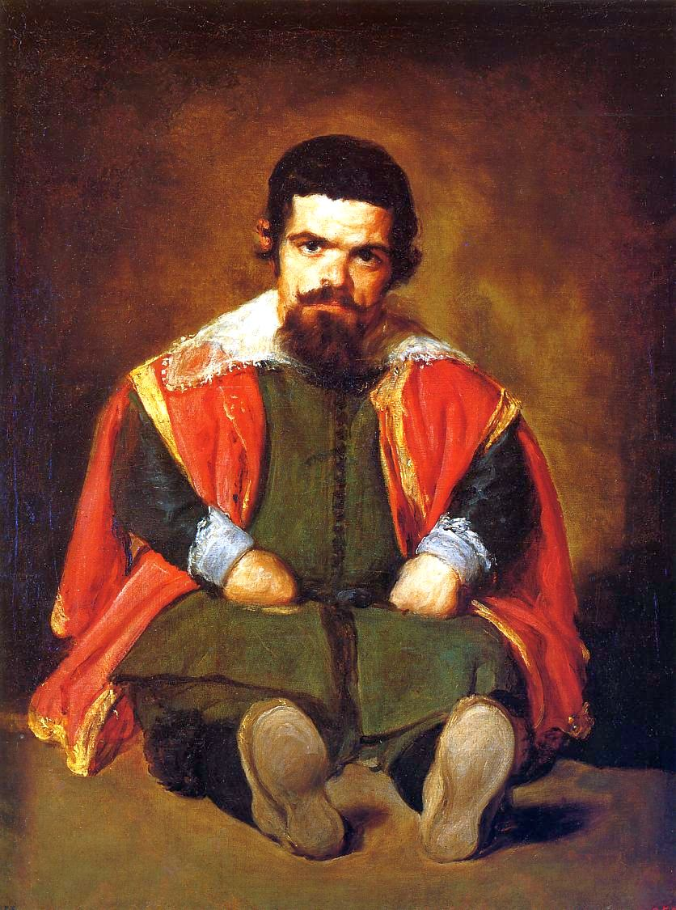

[🏠 Home](../../index.md)

# April 11

## 🧑‍🎨 Painting of the day

[Diego Velazquez](http://en.wikipedia.org/wiki/Diego_Velázquez) (Baroque)

<button class="btn btn-success"
onclick=" window.open('https://lens.google.com/uploadbyurl?url=https://iretes.github.io/one-a-day/data/img/Diego_Velazquez_2.jpg','_blank')">
Search with Google Lens
</button>

## 🎼 Song of the day

> *Fortunate Son*
by Creedence Clearwater Revival

 Written by John Fogerty.

Released in Oct. , 1969.

<button class="btn btn-success"
onclick=" window.open('http://www.youtube.com/search?q=Fortunate Son by Creedence Clearwater Revival','_blank')">
Search on YouTube
</button>

## 🏛️ UNESCO heritage site of the day

> *Atlantic Forest South-East Reserves*, Brazil

The Atlantic Forest South-East Reserves, in the states of Paraná and São Paulo, contain some of the best and most extensive examples of Atlantic forest in Brazil. The 25 protected areas that make up the site (some 470,000 ha in total) display the biological wealth and evolutionary history of the last remaining Atlantic forests. From mountains covered by dense forests, down to wetlands, coastal islands with isolated mountains and dunes, the area comprises a rich natural environment of great scenic beauty.

<button class="btn btn-success"
onclick=" window.open('http://www.google.com/search?q=Atlantic Forest South-East Reserves','_blank')">
Search on Google
</button>

## 🗺️ Place of the day

<iframe
src="https://www.mapcrunch.com"
name="mapcrunch"
width="500"
height="500"
allowTransparency="true"
scrolling="no"
frameborder="0"
>
</iframe>
## 🎨 Color of the day

> *[Middle blue green](https://en.wikipedia.org/wiki/History_of_Crayola_crayons#Munsell_Crayola,_1926–1944)*

&#9632;

## 🌿 Plant of the day

> *arizona sycamore*

<button class="btn btn-success"
onclick=" window.open('http://www.google.com/search?q=arizona sycamore','_blank')">
Search on Google
</button>

## 🧑‍🔬 Scientific discovery of the day

> *2014: Photonic metamaterials are discovered to make passive daytime radiative cooling possible by Raman et al.*

<button class="btn btn-success"
onclick=" window.open('http://www.google.com/search?q=2014: Photonic metamaterials are discovered to make passive daytime radiative cooling possible by Raman et al.','_blank')">
Search on Google
</button>

## 💭 Philosophical concept of the day

> *[Final cause](https://en.wikipedia.org/wiki/Final_cause)*

## 🗣️ Saying of the day

> *Differently abled*

To be 'differently abled' is to be physically or mentally handicapped or disabled but to show qualities that the able-bodied do not have. The expression is intended to avoid the perceived negative connotations of the prefix 'dis' in disabled.
