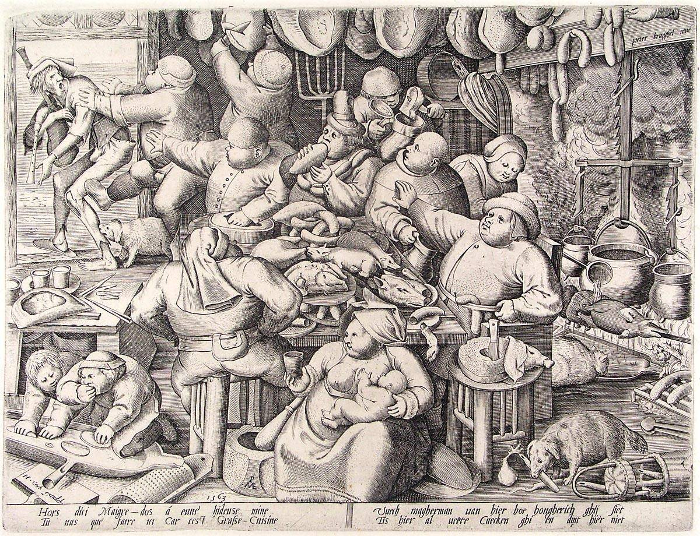

[🏠 Home](../../index.md)

# April 12

## 🧑‍🎨 Painting of the day

[Pieter Bruegel](http://en.wikipedia.org/wiki/Pieter_Bruegel_the_Elder) (Northern Renaissance)

<button class="btn btn-success"
onclick=" window.open('https://lens.google.com/uploadbyurl?url=https://iretes.github.io/one-a-day/data/img/Pieter_Bruegel_4.jpg','_blank')">
Search with Google Lens
</button>

## 🎼 Song of the day

> *Love and Happiness*
by Al Green

 Written by Green, Mabon "Teenie" Hodges.

Released in June , 1972.

<button class="btn btn-success"
onclick=" window.open('http://www.youtube.com/search?q=Love and Happiness by Al Green','_blank')">
Search on YouTube
</button>

## 🏛️ UNESCO heritage site of the day

> *Great Burkhan Khaldun Mountain and its surrounding sacred landscape*, Mongolia

The site is situated in the north-east of the country in the central part of the Khentii mountain chain where the vast Central Asian steppe meets the coniferous forests of the Siberian taiga. Burkhan Khaldun is associated with the worship of sacred mountains, rivers and <em>ovoo-s</em> (shamanic rock cairns), in which ceremonies have been shaped by a fusion of ancient shamanic and Buddhist practices. The site is also believed to be the place of Genghis Khan’s birth and burial. It testifies to his efforts to establish mountain worship as an important part of the unification of the Mongol people.

<button class="btn btn-success"
onclick=" window.open('http://www.google.com/search?q=Great Burkhan Khaldun Mountain and its surrounding sacred landscape','_blank')">
Search on Google
</button>

## 🗺️ Place of the day

<iframe
src="https://www.mapcrunch.com"
name="mapcrunch"
width="500"
height="500"
allowTransparency="true"
scrolling="no"
frameborder="0"
>
</iframe>
## 🎨 Color of the day

> *[Dark jungle green](https://en.wikipedia.org/wiki/Jungle_green#Dark_jungle_green)*

&#9632;

## 🌿 Plant of the day

> *skunk weed*

<button class="btn btn-success"
onclick=" window.open('http://www.google.com/search?q=skunk weed','_blank')">
Search on Google
</button>

## 🧑‍🔬 Scientific discovery of the day

> *260 BC: Aristarchus of Samos proposes a basic heliocentric model of the universe.*

<button class="btn btn-success"
onclick=" window.open('http://www.google.com/search?q=260 BC: Aristarchus of Samos proposes a basic heliocentric model of the universe.','_blank')"> 
Search on Google
</button>

## 💭 Philosophical concept of the day

> *[Distributive justice](https://en.wikipedia.org/wiki/Distributive_justice)*

## 🗣️ Saying of the day

> *Elbow-grease*

Energetic labour.

## 🏳️‍🌈 International day

International Day of Human Space Flight.