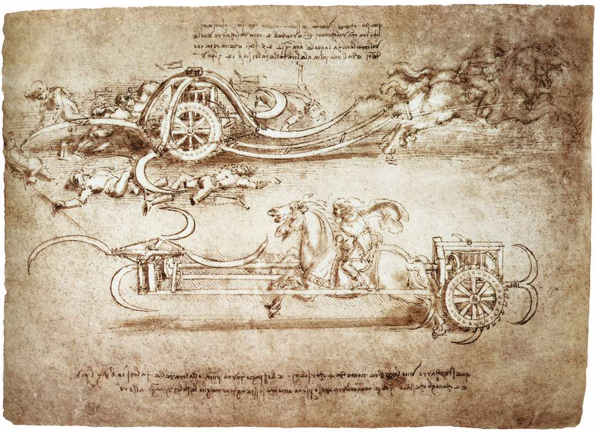

[🏠 Home](../../index.md)

# April 14

## 🧑‍🎨 Painting of the day

[Leonardo da Vinci](http://en.wikipedia.org/wiki/Leonardo_da_Vinci) (High Renaissance)

<button class="btn btn-success"
onclick=" window.open('https://lens.google.com/uploadbyurl?url=https://iretes.github.io/one-a-day/data/img/Leonardo_da_Vinci_5.jpg','_blank')">
Search with Google Lens
</button>

## 🎼 Song of the day

> *Great Balls of Fire*
by Jerry Lee Lewis

 Written by Otis Blackwell, Jack Hammer.

Released in Nov. , 1957.

<button class="btn btn-success"
onclick=" window.open('http://www.youtube.com/search?q=Great Balls of Fire by Jerry Lee Lewis','_blank')">
Search on YouTube
</button>

## 🏛️ UNESCO heritage site of the day

> *Lakes of Ounianga*, Chad

The site includes eighteen interconnected lakes in the hyper arid Ennedi region of the Sahara desert covering an area of 62,808&nbsp;ha. It constitutes an exceptional natural landscape of great beauty with striking colours and shapes. The saline, hyper saline and freshwater lakes are supplied by groundwater and are found in two groups 40&nbsp;km apart. Ounianga Kebir comprises four lakes, the largest of which, Yoan, covers an area of 358&nbsp;ha and is 27&nbsp;m deep. Its highly saline waters only sustain algae and some microorganisms. The second group, Ounianga Serir, comprises fourteen lakes separated by sand dunes. Floating reeds cover almost half the surface of these lakes reducing evaporation. At 436&nbsp;ha, Lake Teli has the largest surface area but is less than 10&nbsp;m deep. With their high quality freshwater, some of these lakes are home to aquatic fauna, particularly fish.

<button class="btn btn-success"
onclick=" window.open('http://www.google.com/search?q=Lakes of Ounianga','_blank')">
Search on Google
</button>

## 🗺️ Place of the day

<iframe
src="https://www.mapcrunch.com"
name="mapcrunch"
width="500"
height="500"
allowTransparency="true"
scrolling="no"
frameborder="0"
>
</iframe>
## 🎨 Color of the day

> *[French lime](https://en.wikipedia.org/wiki/Lime_(color)#French_lime)*

&#9632;

## 🌿 Plant of the day

> *viola species*

<button class="btn btn-success"
onclick=" window.open('http://www.google.com/search?q=viola species','_blank')">
Search on Google
</button>

## 🧑‍🔬 Scientific discovery of the day

> *1909: Fritz Haber: Haber Process for industrial production of ammonia*

<button class="btn btn-success"
onclick=" window.open('http://www.google.com/search?q=1909: Fritz Haber: Haber Process for industrial production of ammonia','_blank')"> 
Search on Google
</button>

## 💭 Philosophical concept of the day

> *[Karma](https://en.wikipedia.org/wiki/Karma)*

## 🗣️ Saying of the day

> *Riley - the life of *

'The life of Riley' is an easy and pleasant life.

## 🏳️‍🌈 International day

World Chagas Disease Day.