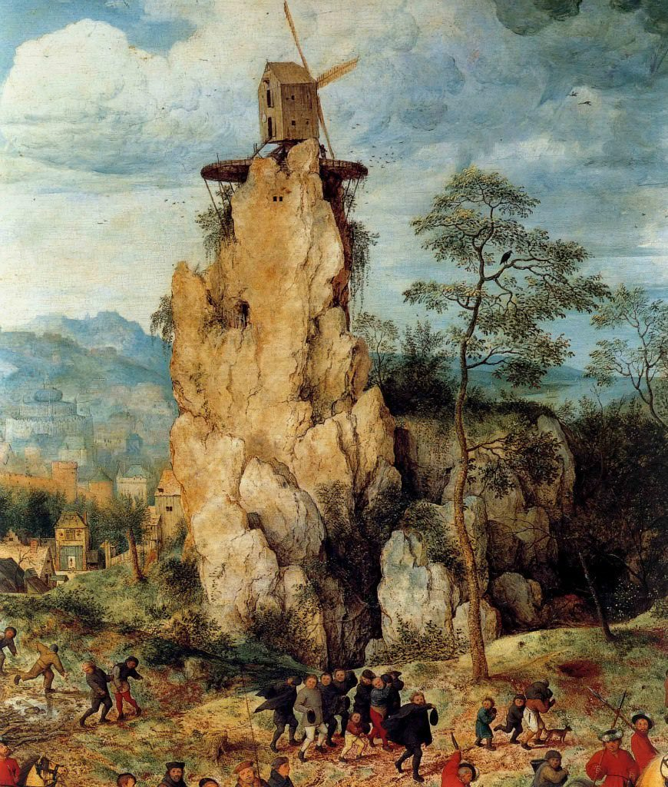

[🏠 Home](../../index.md)

# April 15

## 🧑‍🎨 Painting of the day

[Pieter Bruegel](http://en.wikipedia.org/wiki/Pieter_Bruegel_the_Elder) (Northern Renaissance)

<button class="btn btn-success"
onclick=" window.open('https://lens.google.com/uploadbyurl?url=https://iretes.github.io/one-a-day/data/img/Pieter_Bruegel_2.jpg','_blank')">
Search with Google Lens
</button>

## 🎼 Song of the day

> *Blue Suede Shoes*
by Carl Perkins

 Written by Perkins.

Released in Feb , 1956.

<button class="btn btn-success"
onclick=" window.open('http://www.youtube.com/search?q=Blue Suede Shoes by Carl Perkins','_blank')">
Search on YouTube
</button>

## 🏛️ UNESCO heritage site of the day

> *Vegaøyan – The Vega Archipelago*, Norway

A cluster of dozens of islands centred on Vega, just south of the Arctic Circle, forms a cultural landscape of 107,294 ha, of which 6,881 ha is land. The islands bear testimony to a distinctive frugal way of life based on fishing and the harvesting of the down of eider ducks, in an inhospitable environment. There are fishing villages, quays, warehouses, eider houses (built for eider ducks to nest in), farming landscapes, lighthouses and beacons. There is evidence of human settlement from the Stone Age onwards. By the 9th century, the islands had become an important centre for the supply of down, which appears to have accounted for around a third of the islanders’ income. The Vega Archipelago reflects the way fishermen/farmers have, over the past 1,500 years, maintained a sustainable living and the contribution of women to eiderdown harvesting.

<button class="btn btn-success"
onclick=" window.open('http://www.google.com/search?q=Vegaøyan – The Vega Archipelago','_blank')">
Search on Google
</button>

## 🗺️ Place of the day

<iframe
src="https://www.mapcrunch.com"
name="mapcrunch"
width="500"
height="500"
allowTransparency="true"
scrolling="no"
frameborder="0"
>
</iframe>
## 🎨 Color of the day

> *[Olive green](https://en.wikipedia.org/wiki/Olive_(color)#Olive_green)*

&#9632;

## 🌿 Plant of the day

> *running swamp blackberry*

<button class="btn btn-success"
onclick=" window.open('http://www.google.com/search?q=running swamp blackberry','_blank')">
Search on Google
</button>

## 🧑‍🔬 Scientific discovery of the day

> *1643: Evangelista Torricelli invents the mercury barometer.*

<button class="btn btn-success"
onclick=" window.open('http://www.google.com/search?q=1643: Evangelista Torricelli invents the mercury barometer.','_blank')"> 
Search on Google
</button>

## 💭 Philosophical concept of the day

> *[Raja yoga](https://en.wikipedia.org/wiki/Raja_yoga)*

## 🗣️ Saying of the day

> *Pell-mell*

In disorderly confusion; with reckless haste.
