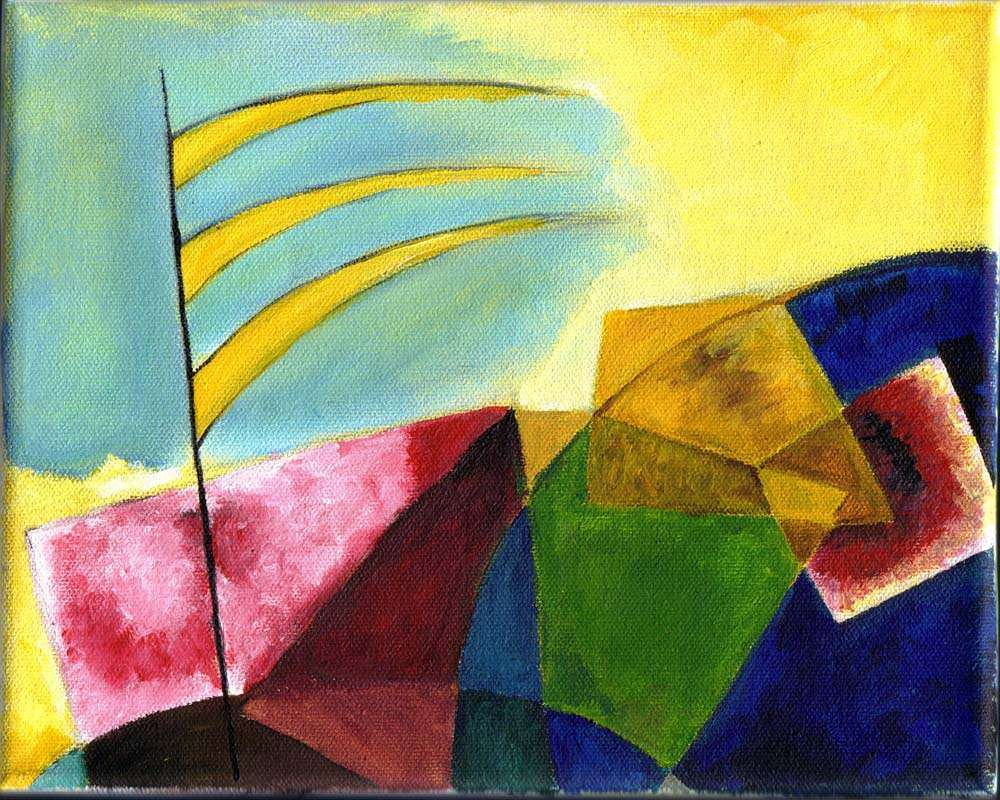

[🏠 Home](../../index.md)

# April 16

## 🧑‍🎨 Painting of the day

[Vasiliy Kandinskiy](http://en.wikipedia.org/wiki/Wassily_Kandinsky) (Expressionism, Abstractionism)

<button class="btn btn-success"
onclick=" window.open('https://lens.google.com/uploadbyurl?url=https://iretes.github.io/one-a-day/data/img/Vasiliy_Kandinskiy_6.jpg','_blank')">
Search with Google Lens
</button>

## 🎼 Song of the day

> *Good Golly*
by Little Richard

 Written by Robert "Bumps" Blackwell, John Marascalco.

Released in Feb. , 1958.

<button class="btn btn-success"
onclick=" window.open('http://www.youtube.com/search?q=Good Golly by Little Richard','_blank')">
Search on YouTube
</button>

## 🏛️ UNESCO heritage site of the day

> *Historic Areas of Istanbul*, Turkey

With its strategic location on the Bosphorus peninsula between the Balkans and Anatolia, the Black Sea and the Mediterranean, Istanbul has been associated with major political, religious and artistic events for more than 2,000 years. Its masterpieces include the ancient Hippodrome of Constantine, the 6th-century Hagia Sophia and the 16th-century Süleymaniye Mosque, all now under threat from population pressure, industrial pollution and uncontrolled urbanization.

<button class="btn btn-success"
onclick=" window.open('http://www.google.com/search?q=Historic Areas of Istanbul','_blank')">
Search on Google
</button>

## 🗺️ Place of the day

<iframe
src="https://www.mapcrunch.com"
name="mapcrunch"
width="500"
height="500"
allowTransparency="true"
scrolling="no"
frameborder="0"
>
</iframe>
## 🎨 Color of the day

> *[Wintergreen Dream](https://en.wikipedia.org/wiki/List_of_Crayola_crayon_colors#Silver_Swirls)*

&#9632;

## 🌿 Plant of the day

> *eastern black oak*

<button class="btn btn-success"
onclick=" window.open('http://www.google.com/search?q=eastern black oak','_blank')">
Search on Google
</button>

## 🧑‍🔬 Scientific discovery of the day

> *1628: William Harvey: blood circulation.*

<button class="btn btn-success"
onclick=" window.open('http://www.google.com/search?q=1628: William Harvey: blood circulation.','_blank')"> 
Search on Google
</button>

## 💭 Philosophical concept of the day

> *[Normativity](https://en.wikipedia.org/wiki/Normativity)*

## 🗣️ Saying of the day

> *First dibs*

'First dibs' is an exclamation that is used, primarily by children but also by adults, to establish a claim on something. The first person to call out 'dibs' or 'first dibs' has the option on the first use or the ownership of the item claimed.
