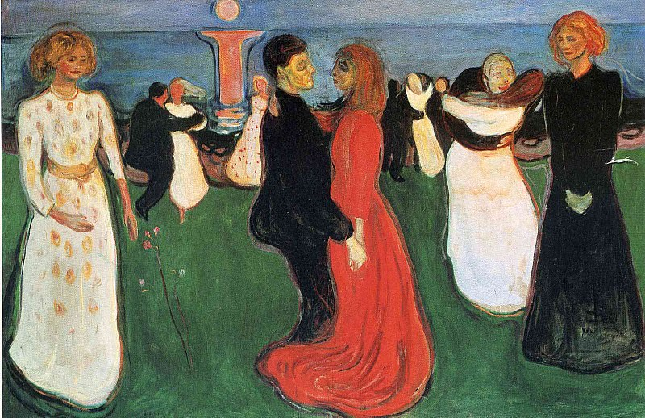

[🏠 Home](../../index.md)

# April 17

## 🧑‍🎨 Painting of the day

[Edvard Munch](https://en.wikipedia.org/wiki/Edvard_Munch) (Symbolism, Expressionism)

<button class="btn btn-success"
onclick=" window.open('https://lens.google.com/uploadbyurl?url=https://iretes.github.io/one-a-day/data/img/Edvard_Munch_4.jpg','_blank')">
Search with Google Lens
</button>

## 🎼 Song of the day

> *I Still Havent Found What Im Looking For*
by U2

 Written by Bono.

Released in May , 1987.

<button class="btn btn-success"
onclick=" window.open('http://www.youtube.com/search?q=I Still Havent Found What Im Looking For by U2','_blank')">
Search on YouTube
</button>

## 🏛️ UNESCO heritage site of the day

> *Lena Pillars Nature Park*, Russian Federation

Lena Pillars Nature Park is marked by spectacular rock pillars that reach a height of approximately 100 m along the banks of the Lena River in the central part of the Sakha Republic (Yakutia). They were produced by the region’s extreme continental climate with an annual temperature range of almost 100 degrees Celsius (from –60 °C in winter to +40 °C in summer). The pillars form rocky buttresses isolated from each other by deep and steep gullies developed by frost shattering directed along intervening joints. Penetration of water from the surface has facilitated cryogenic processes (freeze-thaw action), which have widened gullies between pillars leading to their isolation. Fluvial processes are also critical to the pillars. The site also contains a wealth of Cambrian fossil remains of numerous species, some of them unique.

<button class="btn btn-success"
onclick=" window.open('http://www.google.com/search?q=Lena Pillars Nature Park','_blank')">
Search on Google
</button>

## 🗺️ Place of the day

<iframe
src="https://www.mapcrunch.com"
name="mapcrunch"
width="500"
height="500"
allowTransparency="true"
scrolling="no"
frameborder="0"
>
</iframe>
## 🎨 Color of the day

> *[Sand dune](https://en.wikipedia.org/wiki/Desert_sand_(color)#Sand_dune_(Drab))*

&#9632;

## 🌿 Plant of the day

> *upland cress*

<button class="btn btn-success"
onclick=" window.open('http://www.google.com/search?q=upland cress','_blank')">
Search on Google
</button>

## 🧑‍🔬 Scientific discovery of the day

> *1906: Walther Nernst: Third law of thermodynamics*

<button class="btn btn-success"
onclick=" window.open('http://www.google.com/search?q=1906: Walther Nernst: Third law of thermodynamics','_blank')"> 
Search on Google
</button>

## 💭 Philosophical concept of the day

> *[Agency](https://en.wikipedia.org/wiki/Agency_(philosophy))*

## 🗣️ Saying of the day

> *Lily-livered*

Cowardly.
