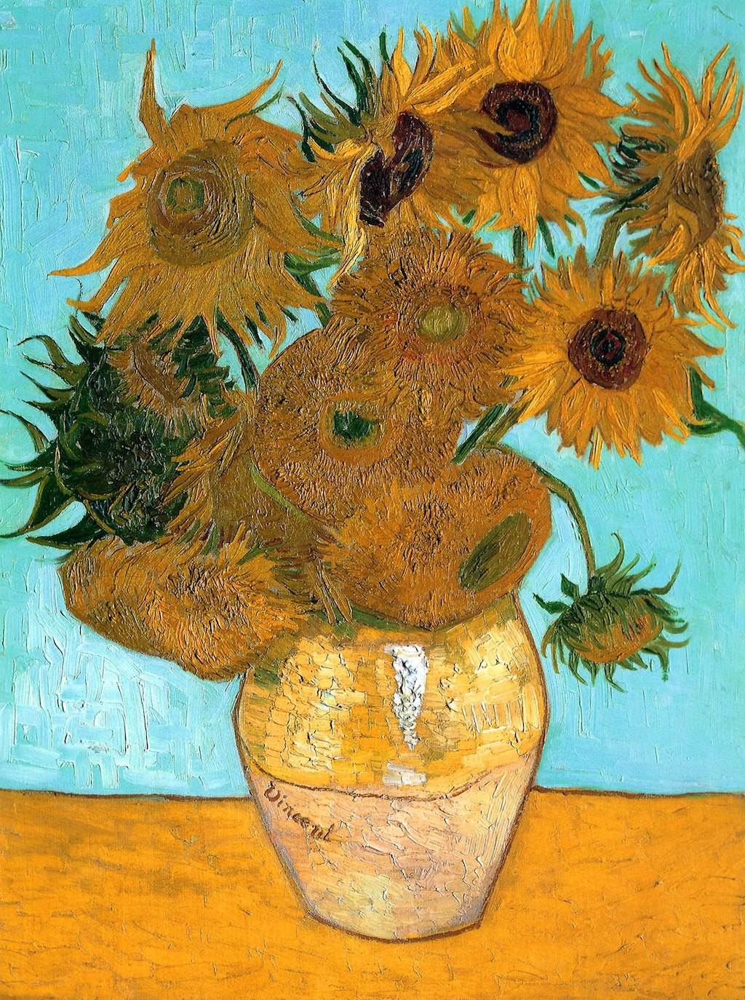

[🏠 Home](../../index.md)

# April 18

## 🧑‍🎨 Painting of the day

[Vincent van Gogh](http://en.wikipedia.org/wiki/Vincent_van_Gogh) (Post-Impressionism)

<button class="btn btn-success"
onclick=" window.open('https://lens.google.com/uploadbyurl?url=https://iretes.github.io/one-a-day/data/img/Vincent_van_Gogh_3.jpg','_blank')">
Search with Google Lens
</button>

## 🎼 Song of the day

> *Blitzkrieg Bop*
by Ramones

 Written by The Ramones.

Released in May , 1976.

<button class="btn btn-success"
onclick=" window.open('http://www.youtube.com/search?q=Blitzkrieg Bop by Ramones','_blank')">
Search on YouTube
</button>

## 🏛️ UNESCO heritage site of the day

> *The Persian Garden*, Iran (Islamic Republic of)

The property includes nine gardens in as many provinces. They exemplify the diversity of Persian garden designs that evolved and adapted to different climate conditions while retaining principles that have their roots in the times of Cyrus the Great, 6th century BC. Always divided into four sectors, with water playing an important role for both irrigation and ornamentation, the Persian garden was conceived to symbolize Eden and the four Zoroastrian elements of sky, earth, water and plants. These gardens, dating back to different periods since the 6th century BC, also feature buildings, pavilions and walls, as well as sophisticated irrigation systems. They have influenced the art of garden design as far as India and Spain.

<button class="btn btn-success"
onclick=" window.open('http://www.google.com/search?q=The Persian Garden','_blank')">
Search on Google
</button>

## 🗺️ Place of the day

<iframe
src="https://www.mapcrunch.com"
name="mapcrunch"
width="500"
height="500"
allowTransparency="true"
scrolling="no"
frameborder="0"
>
</iframe>
## 🎨 Color of the day

> *[Coffee](https://en.wikipedia.org/wiki/Coffee_(color))*

&#9632;

## 🌿 Plant of the day

> *way thistle*

<button class="btn btn-success"
onclick=" window.open('http://www.google.com/search?q=way thistle','_blank')">
Search on Google
</button>

## 🧑‍🔬 Scientific discovery of the day

> *9th century: Mahāvīra discovers the first algorithm for writing fractions as Egyptian fractions, which is in fact a slightly more general form of the Greedy algorithm for Egyptian fractions.*

<button class="btn btn-success"
onclick=" window.open('http://www.google.com/search?q=9th century: Mahāvīra discovers the first algorithm for writing fractions as Egyptian fractions, which is in fact a slightly more general form of the Greedy algorithm for Egyptian fractions.','_blank')">
Search on Google
</button>

## 💭 Philosophical concept of the day

> *[Binary opposition](https://en.wikipedia.org/wiki/Binary_opposition)*

## 🗣️ Saying of the day

> *Popular fallacies - The Nonsense Nine *

People like to retell stories about the origin of some phrase or other. I get mail, phone calls, posts on Facebook. 
