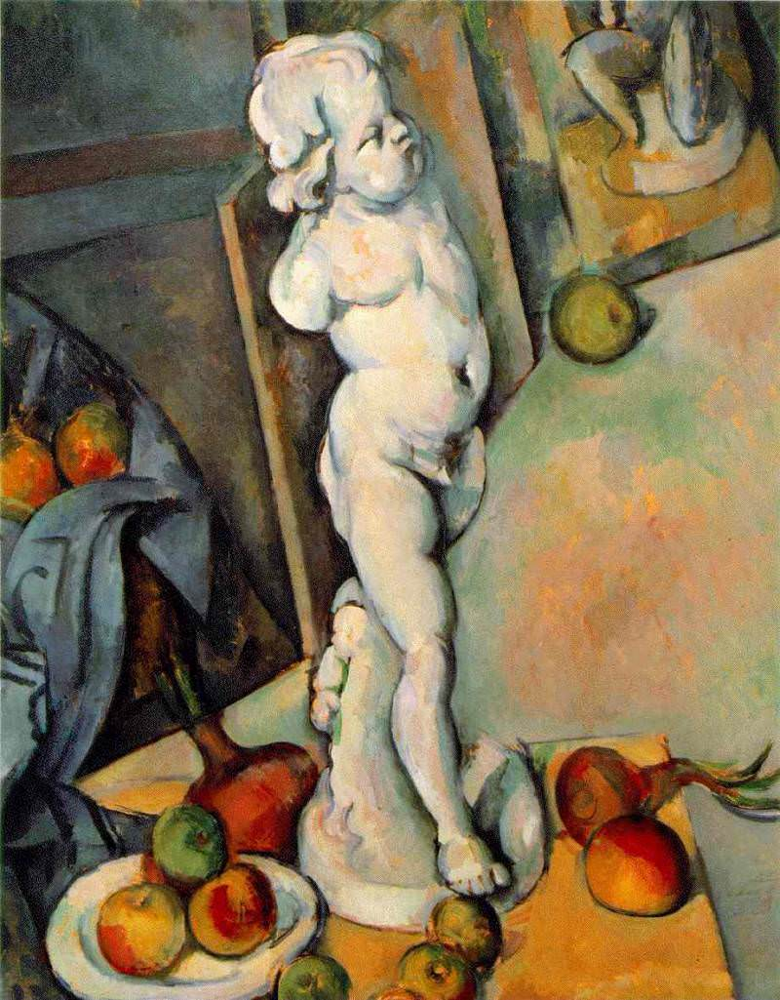

[🏠 Home](../../index.md)

# April 19

## 🧑‍🎨 Painting of the day

[Paul Cezanne](https://en.wikipedia.org/wiki/Paul_Cézanne) (Post-Impressionism)

<button class="btn btn-success"
onclick=" window.open('https://lens.google.com/uploadbyurl?url=https://iretes.github.io/one-a-day/data/img/Paul_Cezanne_2.jpg','_blank')">
Search with Google Lens
</button>

## 🎼 Song of the day

> *Suspicious Minds*
by Elvis Presley

 Written by Mark James.

Released in Sept. , 1969.

<button class="btn btn-success"
onclick=" window.open('http://www.youtube.com/search?q=Suspicious Minds by Elvis Presley','_blank')">
Search on YouTube
</button>

## 🏛️ UNESCO heritage site of the day

> *Wadi Al-Hitan (Whale Valley)*, Egypt

Wadi Al-Hitan, Whale Valley, in the Western Desert of Egypt, contains invaluable fossil remains of the earliest, and now extinct, suborder of whales, Archaeoceti. These fossils represent one of the major stories of evolution: the emergence of the whale as an ocean-going mammal from a previous life as a land-based animal. This is the most important site in the world for the demonstration of this stage of evolution. It portrays vividly the form and life of these whales during their transition. The number, concentration and quality of such fossils here is unique, as is their accessibility and setting in an attractive and protected landscape. The fossils of Al-Hitan show the youngest archaeocetes, in the last stages of losing their hind limbs. Other fossil material in the site makes it possible to reconstruct the surrounding environmental and ecological conditions of the time.

<button class="btn btn-success"
onclick=" window.open('http://www.google.com/search?q=Wadi Al-Hitan (Whale Valley)','_blank')">
Search on Google
</button>

## 🗺️ Place of the day

<iframe
src="https://www.mapcrunch.com"
name="mapcrunch"
width="500"
height="500"
allowTransparency="true"
scrolling="no"
frameborder="0"
>
</iframe>
## 🎨 Color of the day

> *[Oxblood](https://en.wikipedia.org/wiki/Oxblood)*

&#9632;

## 🌿 Plant of the day

> *red willow*

<button class="btn btn-success"
onclick=" window.open('http://www.google.com/search?q=red willow','_blank')">
Search on Google
</button>

## 🧑‍🔬 Scientific discovery of the day

> *1925: Erwin Schrödinger: Schrödinger equation (Quantum mechanics)*

<button class="btn btn-success"
onclick=" window.open('http://www.google.com/search?q=1925: Erwin Schrödinger: Schrödinger equation (Quantum mechanics)','_blank')"> 
Search on Google
</button>

## 💭 Philosophical concept of the day

> *[Ethics of care](https://en.wikipedia.org/wiki/Ethics_of_care)*

## 🗣️ Saying of the day

> *Harp on*

To repeatedly and boringly speak about a topic.
