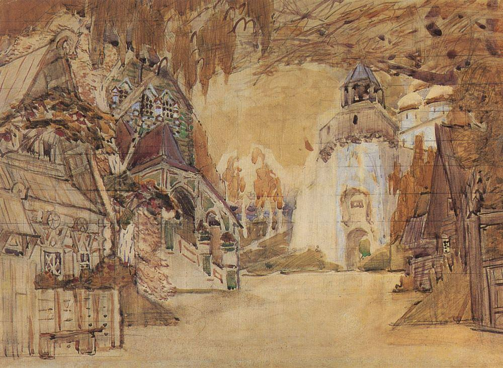

[🏠 Home](../../index.md)

# April 21

## 🧑‍🎨 Painting of the day

[Mikhail Vrubel](http://en.wikipedia.org/wiki/Mikhail_Vrubel) (Symbolism)

<button class="btn btn-success"
onclick=" window.open('https://lens.google.com/uploadbyurl?url=https://iretes.github.io/one-a-day/data/img/Mikhail_Vrubel_2.jpg','_blank')">
Search with Google Lens
</button>

## 🎼 Song of the day

> *California Dreamin*
by The Mamas and the Papas

 Written by John and Michelle Phillips.

Released in Dec. , 1965.

<button class="btn btn-success"
onclick=" window.open('http://www.youtube.com/search?q=California Dreamin by The Mamas and the Papas','_blank')">
Search on YouTube
</button>

## 🏛️ UNESCO heritage site of the day

> *Historic City of Toledo*, Spain

Successively a Roman municipium, the capital of the Visigothic Kingdom, a fortress of the Emirate of Cordoba, an outpost of the Christian kingdoms fighting the Moors and, in the 16th century, the temporary seat of supreme power under Charles V, Toledo is the repository of more than 2,000 years of history. Its masterpieces are the product of heterogeneous civilizations in an environment where the existence of three major religions – Judaism, Christianity and Islam – was a major factor.

<button class="btn btn-success"
onclick=" window.open('http://www.google.com/search?q=Historic City of Toledo','_blank')">
Search on Google
</button>

## 🗺️ Place of the day

<iframe
src="https://www.mapcrunch.com"
name="mapcrunch"
width="500"
height="500"
allowTransparency="true"
scrolling="no"
frameborder="0"
>
</iframe>
## 🎨 Color of the day

> *[Mellow yellow](https://en.wikipedia.org/wiki/Shades_of_yellow#Mellow_yellow)*

&#9632;

## 🌿 Plant of the day

> *rheumatism root*

<button class="btn btn-success"
onclick=" window.open('http://www.google.com/search?q=rheumatism root','_blank')">
Search on Google
</button>

## 🧑‍🔬 Scientific discovery of the day

> *1880: Pierre Curie and Jacques Curie: Piezoelectricity.*

<button class="btn btn-success"
onclick=" window.open('http://www.google.com/search?q=1880: Pierre Curie and Jacques Curie: Piezoelectricity.','_blank')">
Search on Google
</button>

## 💭 Philosophical concept of the day

> *[Creativity](https://en.wikipedia.org/wiki/Creativity)*

## 🗣️ Saying of the day

> *Cat burglar*

A 'Cat burglar' is a burglar who enters buildings by extraordinarily skilful feats of climbing.

## 🏳️‍🌈 International day

World Creativity and Innovation Day.