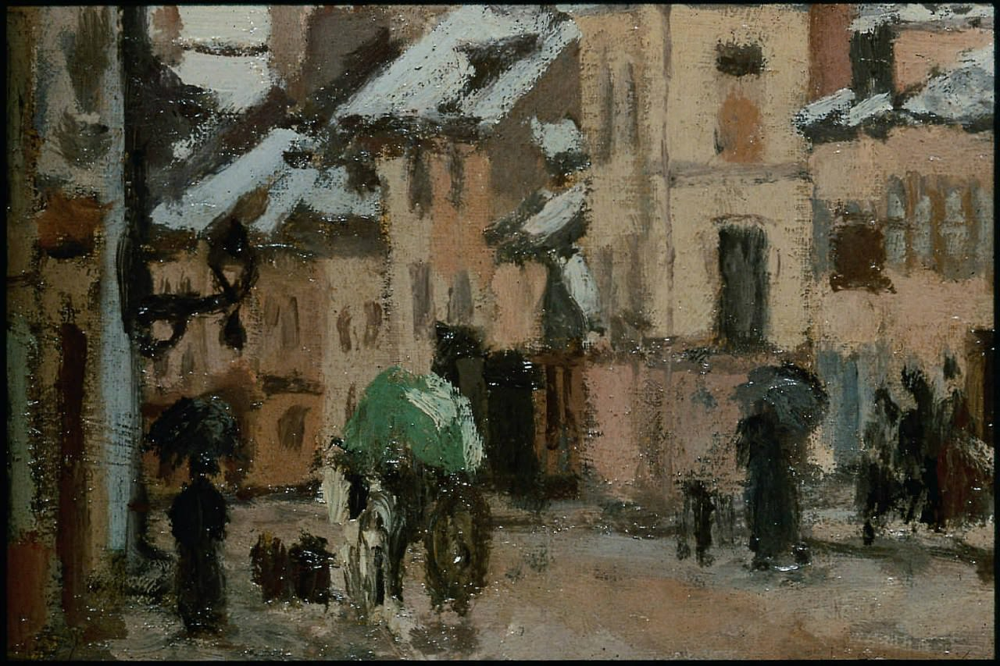

[🏠 Home](../../index.md)

# April 22

## 🧑‍🎨 Painting of the day

[Camille Pissarro](https://en.wikipedia.org/wiki/Camille_Pissarro) (Impressionism, Post-Impressionism)

<button class="btn btn-success"
onclick=" window.open('https://lens.google.com/uploadbyurl?url=https://iretes.github.io/one-a-day/data/img/Camille_Pissarro_3.jpg','_blank')">
Search with Google Lens
</button>

## 🎼 Song of the day

> *My Girl*
by The Temptations

 Written by Smokey Robinson, Ronald White.

Released in Jan. , 1965.

<button class="btn btn-success"
onclick=" window.open('http://www.youtube.com/search?q=My Girl by The Temptations','_blank')">
Search on YouTube
</button>

## 🏛️ UNESCO heritage site of the day

> *Major Town Houses of the Architect Victor Horta (Brussels)*, Belgium

The four major town houses - H&ocirc;tel Tassel, H&ocirc;tel Solvay, H&ocirc;tel van Eetvelde, and Maison &amp; Atelier Horta - located in Brussels and designed by the architect Victor Horta, one of the earliest initiators of Art Nouveau, are some of the most remarkable pioneering works of architecture of the end of the 19th century. The stylistic revolution represented by these works is characterised by their open plan, the diffusion of light, and the brilliant joining of the curved lines of decoration with the structure of the building.

<button class="btn btn-success"
onclick=" window.open('http://www.google.com/search?q=Major Town Houses of the Architect Victor Horta (Brussels)','_blank')">
Search on Google
</button>

## 🗺️ Place of the day

<iframe
src="https://www.mapcrunch.com"
name="mapcrunch"
width="500"
height="500"
allowTransparency="true"
scrolling="no"
frameborder="0"
>
</iframe>
## 🎨 Color of the day

> *[Japanese violet](https://en.wikipedia.org/wiki/Shades_of_violet#Japanese_violet)*

&#9632;

## 🌿 Plant of the day

> *violet bloom*

<button class="btn btn-success"
onclick=" window.open('http://www.google.com/search?q=violet bloom','_blank')">
Search on Google
</button>

## 🧑‍🔬 Scientific discovery of the day

> *2004: Andre Geim and Konstantin Novoselov isolated graphene, a monolayer of carbon atoms, and studied its quantum electrical properties.*

<button class="btn btn-success"
onclick=" window.open('http://www.google.com/search?q=2004: Andre Geim and Konstantin Novoselov isolated graphene, a monolayer of carbon atoms, and studied its quantum electrical properties.','_blank')">
Search on Google
</button>

## 💭 Philosophical concept of the day

> *[Simulated reality](https://en.wikipedia.org/wiki/Simulated_reality)*

## 🗣️ Saying of the day

> *Big Easy - The *

Nickname
for New Orleans, USA, referring
to the easy-going, laid back attitude to life that jazz musicians and local residents indulge in there.

## 🏳️‍🌈 International day

International Mother Earth Day.