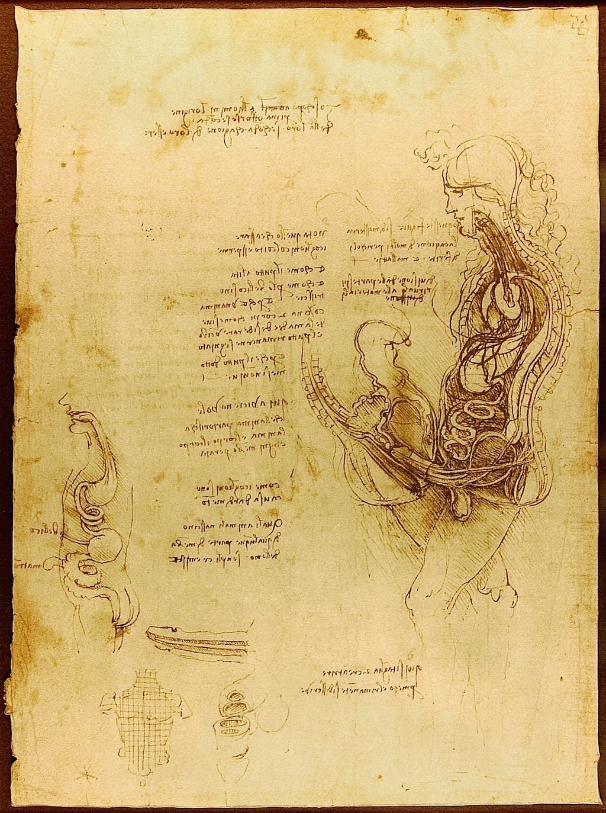

[🏠 Home](../../index.md)

# April 23

## 🧑‍🎨 Painting of the day

[Leonardo da Vinci](http://en.wikipedia.org/wiki/Leonardo_da_Vinci) (High Renaissance)

<button class="btn btn-success"
onclick=" window.open('https://lens.google.com/uploadbyurl?url=https://iretes.github.io/one-a-day/data/img/Leonardo_da_Vinci_2.jpg','_blank')">
Search with Google Lens
</button>

## 🎼 Song of the day

> *Ring of Fire*
by Johnny Cash

 Written by June Carter, Merle Kilgore.

Released in May , 1963.

<button class="btn btn-success"
onclick=" window.open('http://www.youtube.com/search?q=Ring of Fire by Johnny Cash','_blank')">
Search on YouTube
</button>

## 🏛️ UNESCO heritage site of the day

> *The par force hunting landscape in North Zealand*, Denmark

Located about 30 km northeast of Copenhagen, this cultural landscape encompasses the two hunting forests of Store Dyrehave and Gribskov, as well as the hunting park of Jægersborg Hegn/Jægersborg Dyrehave. This is a designed landscape where Danish kings and their court practiced par force hunting, or hunting with hounds, which reached its peak between the 17th and the late 18th centuries, when the absloute monarchs transformed it into a landscape of power. With hunting lanes laid out in a star system, combined with an orthogonal grid pattern, numbered stone posts, fences and a hunting lodge, the site demonstrates the application of Baroque landscaping principles to forested areas.

<button class="btn btn-success"
onclick=" window.open('http://www.google.com/search?q=The par force hunting landscape in North Zealand','_blank')">
Search on Google
</button>

## 🗺️ Place of the day

<iframe
src="https://www.mapcrunch.com"
name="mapcrunch"
width="500"
height="500"
allowTransparency="true"
scrolling="no"
frameborder="0"
>
</iframe>
## 🎨 Color of the day

> *[Light periwinkle](https://en.wikipedia.org/wiki/Periwinkle_(color)#Light_periwinkle)*

&#9632;

## 🌿 Plant of the day

> *mahogany birch*

<button class="btn btn-success"
onclick=" window.open('http://www.google.com/search?q=mahogany birch','_blank')">
Search on Google
</button>

## 🧑‍🔬 Scientific discovery of the day

> *500 BC: Anaxagoras identifies moonlight as reflected sunlight.*

<button class="btn btn-success"
onclick=" window.open('http://www.google.com/search?q=500 BC: Anaxagoras identifies moonlight as reflected sunlight.','_blank')"> 
Search on Google
</button>

## 💭 Philosophical concept of the day

> *[Definition](https://en.wikipedia.org/wiki/Definition)*

## 🗣️ Saying of the day

> *Sticky wicket*

A
difficult situation.

## 🏳️‍🌈 International day

World Book and Copyright Day, English Language Day, Spanish Language Day.