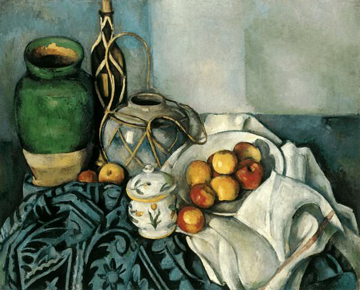

[🏠 Home](../../index.md)

# April 25

## 🧑‍🎨 Painting of the day

[Paul Cezanne](https://en.wikipedia.org/wiki/Paul_Cézanne) (Post-Impressionism)

<button class="btn btn-success"
onclick=" window.open('https://lens.google.com/uploadbyurl?url=https://iretes.github.io/one-a-day/data/img/Paul_Cezanne_1.jpg','_blank')">
Search with Google Lens
</button>

## 🎼 Song of the day

> *Crazy*
by Patsy Cline

 Written by Willie Nelson.

Released in Oct. , 1961.

<button class="btn btn-success"
onclick=" window.open('http://www.youtube.com/search?q=Crazy by Patsy Cline','_blank')">
Search on YouTube
</button>

## 🏛️ UNESCO heritage site of the day

> *Kondoa Rock-Art Sites*, United Republic of Tanzania

On the eastern slopes of the Masai escarpment bordering the Great Rift Valley are natural rock shelters, overhanging slabs of sedimentary rocks fragmented by rift faults, whose vertical planes have been used for rock paintings for at least two millennia. The spectacular collection of images from over 150 shelters over 2,336 km2 , many with high artistic value, displays sequences that provide a unique testimony to the changing socio-economic base of the area from hunter-gatherer to agro-pastoralist, and the beliefs and ideas associated with the different societies. Some of the shelters are still considered to have ritual associations with the people who live nearby, reflecting their beliefs, rituals and cosmological traditions.

<button class="btn btn-success"
onclick=" window.open('http://www.google.com/search?q=Kondoa Rock-Art Sites','_blank')">
Search on Google
</button>

## 🗺️ Place of the day

<iframe
src="https://www.mapcrunch.com"
name="mapcrunch"
width="500"
height="500"
allowTransparency="true"
scrolling="no"
frameborder="0"
>
</iframe>
## 🎨 Color of the day

> *[Spring green (Crayola)](https://en.wikipedia.org/wiki/Spring_green_(color)#Spring_green_(traditional))*

&#9632;

## 🌿 Plant of the day

> *houseleek*

<button class="btn btn-success"
onclick=" window.open('http://www.google.com/search?q=houseleek','_blank')">
Search on Google
</button>

## 🧑‍🔬 Scientific discovery of the day

> *1824: Joseph Aspdin develops Portland cement (concrete), by heating ground limestone, clay and gypsum, in a kiln.*

<button class="btn btn-success"
onclick=" window.open('http://www.google.com/search?q=1824: Joseph Aspdin develops Portland cement (concrete), by heating ground limestone, clay and gypsum, in a kiln.','_blank')"> 
Search on Google
</button>

## 💭 Philosophical concept of the day

> *[Friendship](https://en.wikipedia.org/wiki/Friendship)*

## 🗣️ Saying of the day

> *The law is an ass*

Said of the application of the law that is contrary to common sense.

## 🏳️‍🌈 International day

International Girls in ICT Day, World Malaria Day, International Delegate’s Day.