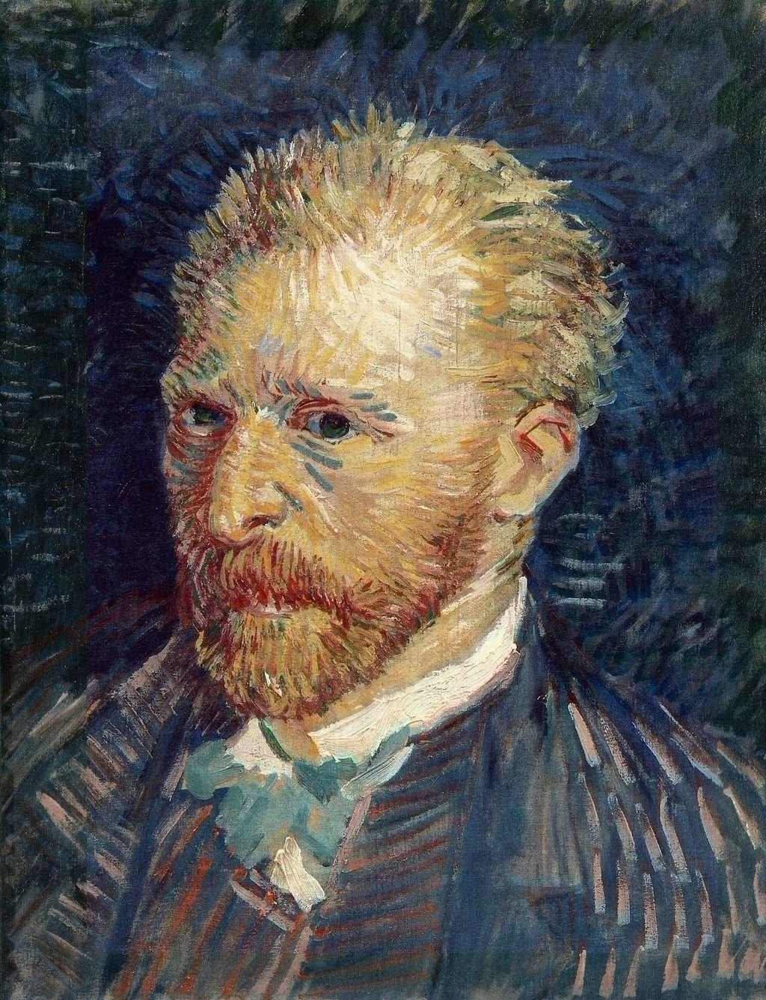

[🏠 Home](../../index.md)

# April 26

## 🧑‍🎨 Painting of the day

[Vincent van Gogh](http://en.wikipedia.org/wiki/Vincent_van_Gogh) (Post-Impressionism)

<button class="btn btn-success"
onclick=" window.open('https://lens.google.com/uploadbyurl?url=https://iretes.github.io/one-a-day/data/img/Vincent_van_Gogh_1.jpg','_blank')">
Search with Google Lens
</button>

## 🎼 Song of the day

> *Every Breath You Take*
by The Police

 Written by Sting.

Released in May , 1983.

<button class="btn btn-success"
onclick=" window.open('http://www.youtube.com/search?q=Every Breath You Take by The Police','_blank')">
Search on YouTube
</button>

## 🏛️ UNESCO heritage site of the day

> *Kyiv: Saint-Sophia Cathedral and Related Monastic Buildings, Kyiv-Pechersk Lavra*, Ukraine

Designed to rival Hagia Sophia in Constantinople, Kyiv's Saint-Sophia Cathedral symbolizes the 'new Constantinople', capital of the Christian principality of Kyiv, which was created in the 11th century in a region evangelized after the baptism of St Vladimir in 988. The spiritual and intellectual influence of Kyiv-Pechersk Lavra contributed to the spread of Orthodox thought and the Orthodox faith in the Russian world from the 17th to the 19th century.

<button class="btn btn-success"
onclick=" window.open('http://www.google.com/search?q=Kyiv: Saint-Sophia Cathedral and Related Monastic Buildings, Kyiv-Pechersk Lavra','_blank')">
Search on Google
</button>

## 🗺️ Place of the day

<iframe
src="https://www.mapcrunch.com"
name="mapcrunch"
width="500"
height="500"
allowTransparency="true"
scrolling="no"
frameborder="0"
>
</iframe>
## 🎨 Color of the day

> *[Tomato](https://en.wikipedia.org/wiki/Shades_of_orange#Tomato)*

&#9632;

## 🌿 Plant of the day

> *big hellebore*

<button class="btn btn-success"
onclick=" window.open('http://www.google.com/search?q=big hellebore','_blank')">
Search on Google
</button>

## 🧑‍🔬 Scientific discovery of the day

> *1787: Jacques Charles: Charles's law of ideal gases.*

<button class="btn btn-success"
onclick=" window.open('http://www.google.com/search?q=1787: Jacques Charles: Charles s law of ideal gases.','_blank')"> 
Search on Google
</button>

## 💭 Philosophical concept of the day

> *[Embodied cognition](https://en.wikipedia.org/wiki/Embodied_cognition)*

## 🗣️ Saying of the day

> *Special relationship*

The relationship between the United Kingdom and the USA.

## 🏳️‍🌈 International day

International Chernobyl Disaster Remembrance Day, World Intellectual Property Day.