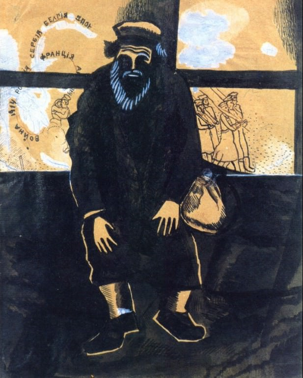

[🏠 Home](../../index.md)

# April 27

## 🧑‍🎨 Painting of the day

[Marc Chagall](http://en.wikipedia.org/wiki/Marc_Chagall) (Primitivism)

<button class="btn btn-success"
onclick=" window.open('https://lens.google.com/uploadbyurl?url=https://iretes.github.io/one-a-day/data/img/Marc_Chagall_7.jpg','_blank')">
Search with Google Lens
</button>

## 🎼 Song of the day

> *Norwegian Wood (This Bird Has Flown)*
by The Beatles

 Written by John Lennon, Paul McCartney.

Released in Dec. , 1965.

<button class="btn btn-success"
onclick=" window.open('http://www.youtube.com/search?q=Norwegian Wood (This Bird Has Flown) by The Beatles','_blank')">
Search on YouTube
</button>

## 🏛️ UNESCO heritage site of the day

> *Yungang Grottoes*, China

The Yungang Grottoes, in Datong city, Shanxi Province, with their 252 caves and 51,000 statues, represent the outstanding achievement of Buddhist cave art in China in the 5th and 6th centuries. The Five Caves created by Tan Yao, with their strict unity of layout and design, constitute a classical masterpiece of the first peak of Chinese Buddhist art.

<button class="btn btn-success"
onclick=" window.open('http://www.google.com/search?q=Yungang Grottoes','_blank')">
Search on Google
</button>

## 🗺️ Place of the day

<iframe
src="https://www.mapcrunch.com"
name="mapcrunch"
width="500"
height="500"
allowTransparency="true"
scrolling="no"
frameborder="0"
>
</iframe>
## 🎨 Color of the day

> *[Tangerine](https://en.wikipedia.org/wiki/Tangerine_(color))*

&#9632;

## 🌿 Plant of the day

> *virginia silk weed*

<button class="btn btn-success"
onclick=" window.open('http://www.google.com/search?q=virginia silk weed','_blank')">
Search on Google
</button>

## 🧑‍🔬 Scientific discovery of the day

> *210: Negative numbers are accepted as numeric by the late Han-era Chinese text The Nine Chapters on the Mathematical Art. Later, Liu Hui of Cao Wei (during the Three Kingdoms period) writes down laws regarding the arithmetic of negative numbers.*

<button class="btn btn-success"
onclick=" window.open('http://www.google.com/search?q=210: Negative numbers are accepted as numeric by the late Han-era Chinese text The Nine Chapters on the Mathematical Art. Later, Liu Hui of Cao Wei (during the Three Kingdoms period) writes down laws regarding the arithmetic of negative numbers.','_blank')">
Search on Google
</button>

## 💭 Philosophical concept of the day

> *[Choice](https://en.wikipedia.org/wiki/Choice)*

## 🗣️ Saying of the day

> *The fly in the ointment*

A fly in the ointment is a small but irritating flaw that spoils the whole. In the 20th century the expression has also come to be used to describe a small flaw that comes to light to spoil  an otherwise faultless plan.
