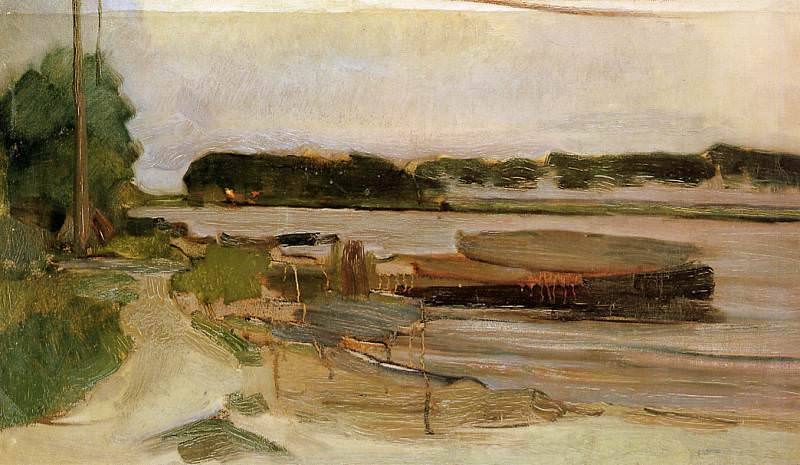

[🏠 Home](../../index.md)

# April 29

## 🧑‍🎨 Painting of the day

[Piet Mondrian](https://en.wikipedia.org/wiki/Piet_Mondrian) (Neoplasticism)

<button class="btn btn-success"
onclick=" window.open('https://lens.google.com/uploadbyurl?url=https://iretes.github.io/one-a-day/data/img/Piet_Mondrian_2.jpg','_blank')">
Search with Google Lens
</button>

## 🎼 Song of the day

> *I Heard It Through the Grapevine*
by Marvin Gaye

 Written by Barrett Strong, Norman Whitfield.

Released in Oct. , 1968.

<button class="btn btn-success"
onclick=" window.open('http://www.youtube.com/search?q=I Heard It Through the Grapevine by Marvin Gaye','_blank')">
Search on YouTube
</button>

## 🏛️ UNESCO heritage site of the day

> *Historic Site of Lyon*, France

The long history of Lyon, which was founded by the Romans in the 1st century B.C. as the capital of the Three Gauls and has continued to play a major role in Europe's political, cultural and economic development ever since, is vividly illustrated by its urban fabric and the many fine historic buildings from all periods.

<button class="btn btn-success"
onclick=" window.open('http://www.google.com/search?q=Historic Site of Lyon','_blank')">
Search on Google
</button>

## 🗺️ Place of the day

<iframe
src="https://www.mapcrunch.com"
name="mapcrunch"
width="500"
height="500"
allowTransparency="true"
scrolling="no"
frameborder="0"
>
</iframe>
## 🎨 Color of the day

> *[Medium aquamarine](https://en.wikipedia.org/wiki/Aquamarine_(color))*

&#9632;

## 🌿 Plant of the day

> *chestnut*

<button class="btn btn-success"
onclick=" window.open('http://www.google.com/search?q=chestnut','_blank')">
Search on Google
</button>

## 🧑‍🔬 Scientific discovery of the day

> *1971: Place cells in the brain are discovered by John O'Keefe*

<button class="btn btn-success"
onclick=" window.open('http://www.google.com/search?q=1971: Place cells in the brain are discovered by John O Keefe','_blank')">
Search on Google
</button>

## 💭 Philosophical concept of the day

> *[Epistemic injustice](https://en.wikipedia.org/wiki/Epistemic_injustice)*

## 🗣️ Saying of the day

> *À la mode*

Fashionable. Also, in the USA, a dessert served with ice cream.
