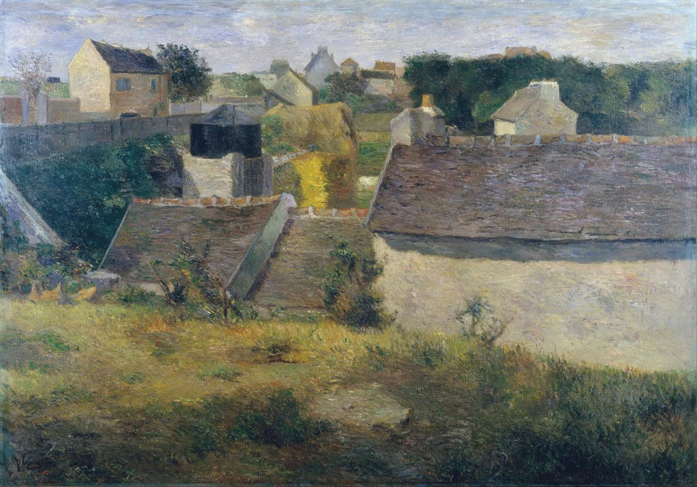

[🏠 Home](../../index.md)

# April 3

## 🧑‍🎨 Painting of the day

[Paul Gauguin](http://en.wikipedia.org/wiki/Paul_Gauguin) (Symbolism, Post-Impressionism)

<button class="btn btn-success"
onclick=" window.open('https://lens.google.com/uploadbyurl?url=https://iretes.github.io/one-a-day/data/img/Paul_Gauguin_3.jpg','_blank')">
Search with Google Lens
</button>

## 🎼 Song of the day

> *Whiter Shade of Pale*
by Procol Harum

 Written by Keith Reid, Gary Brooker.

Released in June , 1967.

<button class="btn btn-success"
onclick=" window.open('http://www.youtube.com/search?q=Whiter Shade of Pale by Procol Harum','_blank')">
Search on YouTube
</button>

## 🏛️ UNESCO heritage site of the day

> *Lushan National Park*, China

Mount Lushan, in Jiangxi, is one of the spiritual centres of Chinese civilization. Buddhist and Taoist temples, along with landmarks of Confucianism, where the most eminent masters taught, blend effortlessly into a strikingly beautiful landscape which has inspired countless artists who developed the aesthetic approach to nature found in Chinese culture.

<button class="btn btn-success"
onclick=" window.open('http://www.google.com/search?q=Lushan National Park','_blank')">
Search on Google
</button>

## 🗺️ Place of the day

<iframe
src="https://www.mapcrunch.com"
name="mapcrunch"
width="500"
height="500"
allowTransparency="true"
scrolling="no"
frameborder="0"
>
</iframe>
## 🎨 Color of the day

> *[Orange-red (Crayola)](https://en.wikipedia.org/wiki/Vermilion)*

&#9632;

## 🌿 Plant of the day

> *horse cane*

<button class="btn btn-success"
onclick=" window.open('http://www.google.com/search?q=horse cane','_blank')">
Search on Google
</button>

## 🧑‍🔬 Scientific discovery of the day

> *200 BC: Apollonius of Perga develops epicycles. While an incorrect model, it was a precursor to the development of Fourier series.*

<button class="btn btn-success"
onclick=" window.open('http://www.google.com/search?q=200 BC: Apollonius of Perga develops epicycles. While an incorrect model, it was a precursor to the development of Fourier series.','_blank')"> 
Search on Google
</button>

## 💭 Philosophical concept of the day

> *[Ideal speech situation](https://en.wikipedia.org/wiki/Ideal_speech_situation)*

## 🗣️ Saying of the day

> *Meat and two veg.*

Meat and two vegetables, that is, meat with potatoes and another vegetable, is a traditional English meal.
