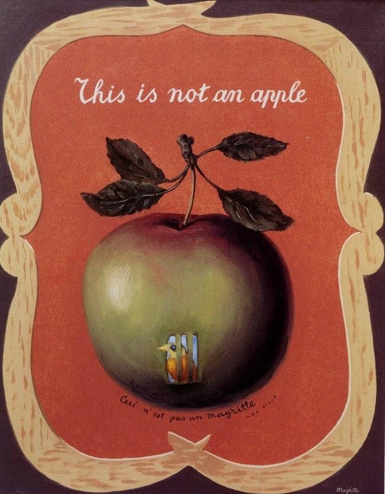

[🏠 Home](../../index.md)

# April 30

## 🧑‍🎨 Painting of the day

[Rene Magritte](http://en.wikipedia.org/wiki/René_Magritte) (Surrealism, Impressionism)

<button class="btn btn-success"
onclick=" window.open('https://lens.google.com/uploadbyurl?url=https://iretes.github.io/one-a-day/data/img/Rene_Magritte_7.jpg','_blank')">
Search with Google Lens
</button>

## 🎼 Song of the day

> *You Really Got Me*
by The Kinks

 Written by Ray Davies.

Released in Sept. , 1964.

<button class="btn btn-success"
onclick=" window.open('http://www.youtube.com/search?q=You Really Got Me by The Kinks','_blank')">
Search on YouTube
</button>

## 🏛️ UNESCO heritage site of the day

> *Sacred Mijikenda Kaya Forests*, Kenya

The Mijikenda Kaya Forests consist of 10 separate forest sites spread over some 200 km along the coast containing the remains of numerous fortified villages, known as kayas, of the Mijikenda people. The kayas, created as of the 16th century but abandoned by the 1940s, are now regarded as the abodes of ancestors and are revered as sacred sites and, as such, are maintained as by councils of elders. The site is inscribed as bearing unique testimony to a cultural tradition and for its direct link to a living tradition.

<button class="btn btn-success"
onclick=" window.open('http://www.google.com/search?q=Sacred Mijikenda Kaya Forests','_blank')">
Search on Google
</button>

## 🗺️ Place of the day

<iframe
src="https://www.mapcrunch.com"
name="mapcrunch"
width="500"
height="500"
allowTransparency="true"
scrolling="no"
frameborder="0"
>
</iframe>
## 🎨 Color of the day

> *[Spanish orange](https://en.wikipedia.org/wiki/Shades_of_orange#Spanish_orange)*

&#9632;

## 🌿 Plant of the day

> *maple ash*

<button class="btn btn-success"
onclick=" window.open('http://www.google.com/search?q=maple ash','_blank')">
Search on Google
</button>

## 🧑‍🔬 Scientific discovery of the day

> *2003: Grigori Perelman presents proof of the Poincaré Conjecture.*

<button class="btn btn-success"
onclick=" window.open('http://www.google.com/search?q=2003: Grigori Perelman presents proof of the Poincaré Conjecture.','_blank')">
Search on Google
</button>

## 💭 Philosophical concept of the day

> *[Theory of justification](https://en.wikipedia.org/wiki/Theory_of_justification)*

## 🗣️ Saying of the day

> *My cup of tea*

Something or someone that one finds pleasing.

## 🏳️‍🌈 International day

International Jazz Day.