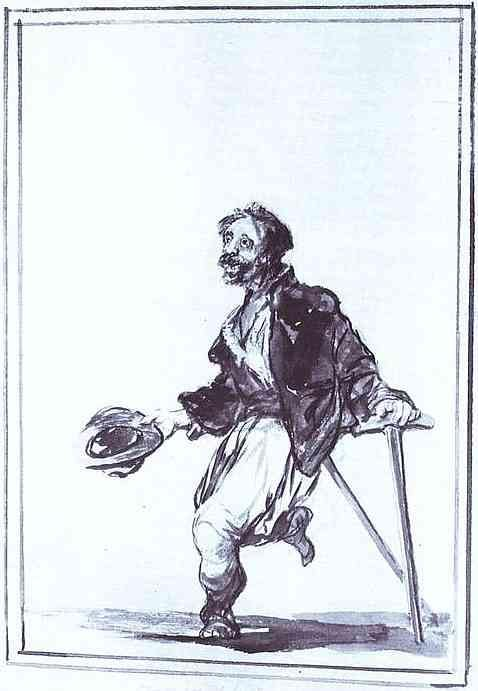

[🏠 Home](../../index.md)

# April 6

## 🧑‍🎨 Painting of the day

[Francisco Goya](http://en.wikipedia.org/wiki/Francisco_Goya) (Romanticism)

<button class="btn btn-success"
onclick=" window.open('https://lens.google.com/uploadbyurl?url=https://iretes.github.io/one-a-day/data/img/Francisco_Goya_6.jpg','_blank')">
Search with Google Lens
</button>

## 🎼 Song of the day

> *Louie Louie*
by The Kingsmen

 Written by Richard Berry.

Released in June , 1963.

<button class="btn btn-success"
onclick=" window.open('http://www.youtube.com/search?q=Louie Louie by The Kingsmen','_blank')">
Search on YouTube
</button>

## 🏛️ UNESCO heritage site of the day

> *Mount Nimba Strict Nature Reserve*, Côte d'Ivoire,Guinea

Located on the borders of Guinea, Liberia and Côte d’Ivoire, Mount Nimba rises above the surrounding savannah. Its slopes are covered by dense forest at the foot of grassy mountain pastures. They harbour an especially rich flora and fauna, with endemic species such as the viviparous toad and chimpanzees that use stones as tools.

<button class="btn btn-success"
onclick=" window.open('http://www.google.com/search?q=Mount Nimba Strict Nature Reserve','_blank')">
Search on Google
</button>

## 🗺️ Place of the day

<iframe
src="https://www.mapcrunch.com"
name="mapcrunch"
width="500"
height="500"
allowTransparency="true"
scrolling="no"
frameborder="0"
>
</iframe>
## 🎨 Color of the day

> *[Pink lace](https://en.wikipedia.org/wiki/Shades_of_pink#Pink_lace)*

&#9632;

## 🌿 Plant of the day

> *cucumber*

<button class="btn btn-success"
onclick=" window.open('http://www.google.com/search?q=cucumber','_blank')">
Search on Google
</button>

## 🧑‍🔬 Scientific discovery of the day

> *2600 BC: The oldest attested evidence for the existence of units of weight, and weighing scales date to the Fourth Dynasty of Egypt, with Deben (unit) balance weights, excavated from the reign of Sneferu, though earlier usage has been proposed.*

<button class="btn btn-success"
onclick=" window.open('http://www.google.com/search?q=2600 BC: The oldest attested evidence for the existence of units of weight, and weighing scales date to the Fourth Dynasty of Egypt, with Deben (unit) balance weights, excavated from the reign of Sneferu, though earlier usage has been proposed.','_blank')"> 
Search on Google
</button>

## 💭 Philosophical concept of the day

> *[Theorem](https://en.wikipedia.org/wiki/Theorem)*

## 🗣️ Saying of the day

> *Charley horse*

Leg cramp or stiffness.

## 🏳️‍🌈 International day

International Day of Sport for Development and Peace.