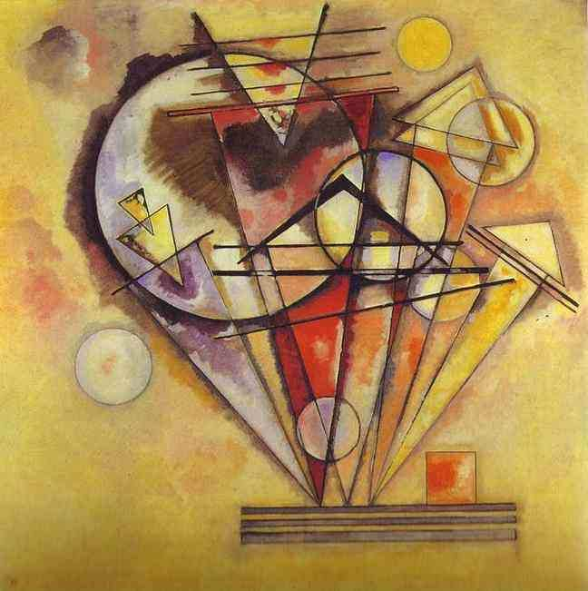

[🏠 Home](../../index.md)

# April 7

## 🧑‍🎨 Painting of the day

[Vasiliy Kandinskiy](http://en.wikipedia.org/wiki/Wassily_Kandinsky) (Expressionism, Abstractionism)

<button class="btn btn-success"
onclick=" window.open('https://lens.google.com/uploadbyurl?url=https://iretes.github.io/one-a-day/data/img/Vasiliy_Kandinskiy_5.jpg','_blank')">
Search with Google Lens
</button>

## 🎼 Song of the day

> *When a Man Loves a Woman*
by Percy Sledge

 Written by Calvin Lewis, Andrew Wright.

Released in March , 1966.

<button class="btn btn-success"
onclick=" window.open('http://www.youtube.com/search?q=When a Man Loves a Woman by Percy Sledge','_blank')">
Search on YouTube
</button>

## 🏛️ UNESCO heritage site of the day

> *Cultural Landscape of Maymand*, Iran (Islamic Republic of)

Maymand is a self-contained, semi-arid area at the end of a valley at the southern extremity of Iran’s central mountains. The villagers are semi-nomadic agro-pastoralists. They raise their animals on mountain pastures, living in temporary settlements in spring and autumn. During the winter months they live lower down the valley in cave dwellings carved out of the soft rock (<em>kamar</em>), an unusual form of housing in a dry, desert environment.  This cultural landscape is an example of a system that appears to have been more widespread in the past and involves the movement of people rather than animals.

<button class="btn btn-success"
onclick=" window.open('http://www.google.com/search?q=Cultural Landscape of Maymand','_blank')">
Search on Google
</button>

## 🗺️ Place of the day

<iframe
src="https://www.mapcrunch.com"
name="mapcrunch"
width="500"
height="500"
allowTransparency="true"
scrolling="no"
frameborder="0"
>
</iframe>
## 🎨 Color of the day

> *[Arctic lime](https://en.wikipedia.org/wiki/Lime_(color)#Arctic_lime)*

&#9632;

## 🌿 Plant of the day

> *meadow cabbage*

<button class="btn btn-success"
onclick=" window.open('http://www.google.com/search?q=meadow cabbage','_blank')">
Search on Google
</button>

## 🧑‍🔬 Scientific discovery of the day

> *1929: Alexander Fleming: Penicillin, the first beta-lactam antibiotic*

<button class="btn btn-success"
onclick=" window.open('http://www.google.com/search?q=1929: Alexander Fleming: Penicillin, the first beta-lactam antibiotic','_blank')"> 
Search on Google
</button>

## 💭 Philosophical concept of the day

> *[Speculative reason](https://en.wikipedia.org/wiki/Speculative_reason)*

## 🗣️ Saying of the day

> *Bill Stickers is innocent*

Play on words, based on 'Bill Stickers...' notices.

## 🏳️‍🌈 International day

World Health Day, International Day of Reflection on the 1994 Genocide against the Tutsi in Rwanda.