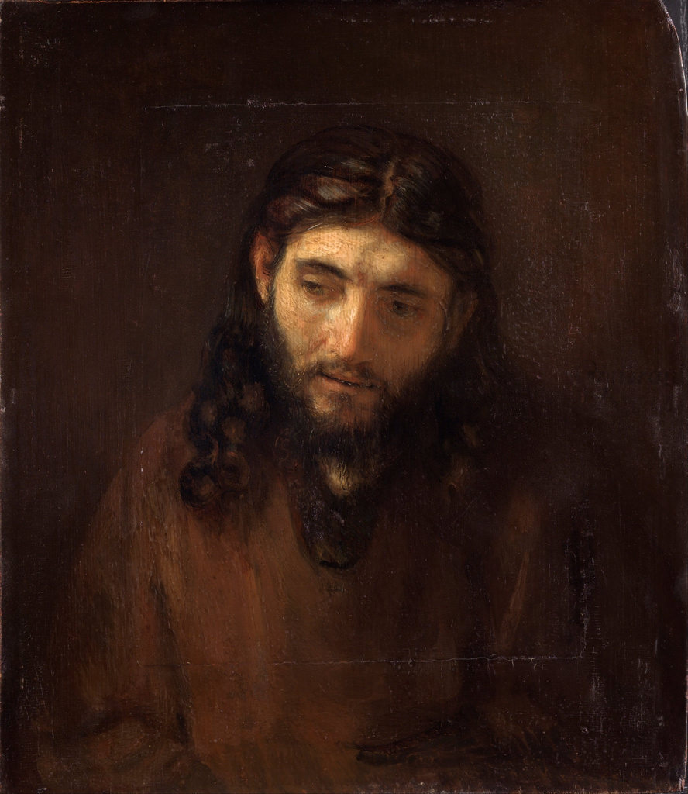

[🏠 Home](../../index.md)

# April 8

## 🧑‍🎨 Painting of the day

[Rembrandt](http://en.wikipedia.org/wiki/Rembrandt) (Baroque)

<button class="btn btn-success"
onclick=" window.open('https://lens.google.com/uploadbyurl?url=https://iretes.github.io/one-a-day/data/img/Rembrandt_5.jpg','_blank')">
Search with Google Lens
</button>

## 🎼 Song of the day

> *When Doves Cry*
by Prince

 Written by Prince.

Released in June , 1984.

<button class="btn btn-success"
onclick=" window.open('http://www.youtube.com/search?q=When Doves Cry by Prince','_blank')">
Search on YouTube
</button>

## 🏛️ UNESCO heritage site of the day

> *Borobudur Temple Compounds*, Indonesia

This famous Buddhist temple, dating from the 8th and 9th centuries, is located in central Java. It was built in three tiers: a pyramidal base with five concentric square terraces, the trunk of a cone with three circular platforms and, at the top, a monumental stupa. The walls and balustrades are decorated with fine low reliefs, covering a total surface area of 2,500 m2. Around the circular platforms are 72 openwork stupas, each containing a statue of the Buddha. The monument was restored with UNESCO's help in the 1970s.

<button class="btn btn-success"
onclick=" window.open('http://www.google.com/search?q=Borobudur Temple Compounds','_blank')">
Search on Google
</button>

## 🗺️ Place of the day

<iframe
src="https://www.mapcrunch.com"
name="mapcrunch"
width="500"
height="500"
allowTransparency="true"
scrolling="no"
frameborder="0"
>
</iframe>
## 🎨 Color of the day

> *[Lavender (floral)](https://en.wikipedia.org/wiki/Lavender_(color)#Lavender_(floral))*

&#9632;

## 🌿 Plant of the day

> *poor annie*

<button class="btn btn-success"
onclick=" window.open('http://www.google.com/search?q=poor annie','_blank')">
Search on Google
</button>

## 🧑‍🔬 Scientific discovery of the day

> *1909: Robert Andrews Millikan: conducts the oil drop experiment and determines the charge on an electron*

<button class="btn btn-success"
onclick=" window.open('http://www.google.com/search?q=1909: Robert Andrews Millikan: conducts the oil drop experiment and determines the charge on an electron','_blank')"> 
Search on Google
</button>

## 💭 Philosophical concept of the day

> *[Superrationality](https://en.wikipedia.org/wiki/Superrationality)*

## 🗣️ Saying of the day

> *Spitting image*

The exact likeness.
