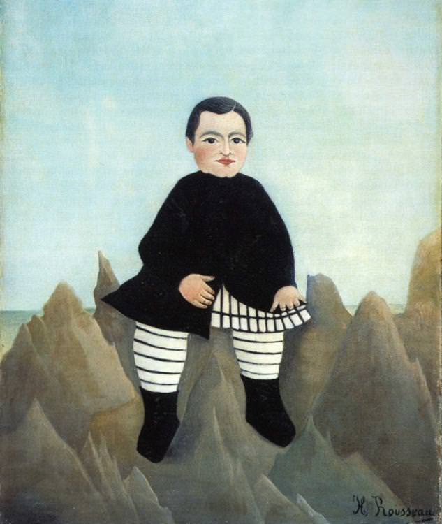

[🏠 Home](../../index.md)

# April 9

## 🧑‍🎨 Painting of the day

[Henri Rousseau](https://en.wikipedia.org/wiki/Henri_Rousseau) (Primitivism)

<button class="btn btn-success"
onclick=" window.open('https://lens.google.com/uploadbyurl?url=https://iretes.github.io/one-a-day/data/img/Henri_Rousseau_6.jpg','_blank')">
Search with Google Lens
</button>

## 🎼 Song of the day

> *The Message*
by Grandmaster Flash and the Furious Five

 Written by Duke Bootee, Melle Mel.

Released in May , 1982.

<button class="btn btn-success"
onclick=" window.open('http://www.youtube.com/search?q=The Message by Grandmaster Flash and the Furious Five','_blank')">
Search on YouTube
</button>

## 🏛️ UNESCO heritage site of the day

> *Blenheim Palace*, United Kingdom of Great Britain and Northern Ireland

Blenheim Palace, near Oxford, stands in a romantic park created by the famous landscape gardener 'Capability' Brown. It was presented by the English nation to John Churchill, first Duke of Marlborough, in recognition of his victory in 1704 over French and Bavarian troops. Built between 1705 and 1722 and characterized by an eclectic style and a return to national roots, it is a perfect example of an 18th-century princely dwelling.

<button class="btn btn-success"
onclick=" window.open('http://www.google.com/search?q=Blenheim Palace','_blank')">
Search on Google
</button>

## 🗺️ Place of the day

<iframe
src="https://www.mapcrunch.com"
name="mapcrunch"
width="500"
height="500"
allowTransparency="true"
scrolling="no"
frameborder="0"
>
</iframe>
## 🎨 Color of the day

> *[Charcoal](https://en.wikipedia.org/wiki/Shades_of_gray#Charcoal)*

&#9632;

## 🌿 Plant of the day

> *swine thistle*

<button class="btn btn-success"
onclick=" window.open('http://www.google.com/search?q=swine thistle','_blank')">
Search on Google
</button>

## 🧑‍🔬 Scientific discovery of the day

> *1907: Alfred Bertheim: Arsphenamine, the first modern chemotherapeutic agent*

<button class="btn btn-success"
onclick=" window.open('http://www.google.com/search?q=1907: Alfred Bertheim: Arsphenamine, the first modern chemotherapeutic agent','_blank')">
Search on Google
</button>

## 💭 Philosophical concept of the day

> *[Peace](https://en.wikipedia.org/wiki/Peace)*

## 🗣️ Saying of the day

> *Hoity-toity*

 Pretentiously self-important, haughty or pompous.
