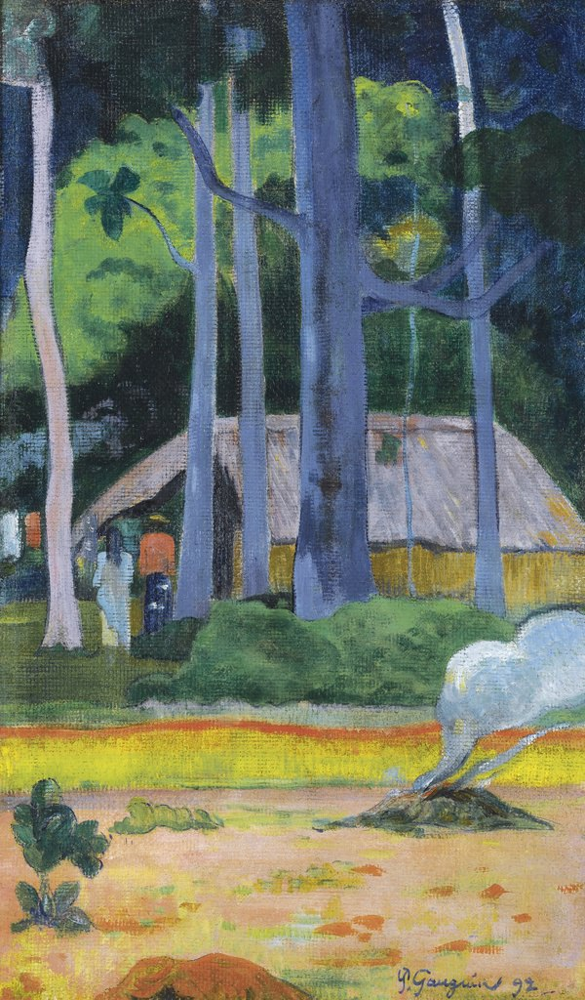

[🏠 Home](../../index.md)

# August 1

## 🧑‍🎨 Painting of the day

[Paul Gauguin](http://en.wikipedia.org/wiki/Paul_Gauguin) (Symbolism, Post-Impressionism)

<button class="btn btn-success"
onclick=" window.open('https://lens.google.com/uploadbyurl?url=https://iretes.github.io/one-a-day/data/img/Paul_Gauguin_7.jpg','_blank')">
Search with Google Lens
</button>

## 🎼 Song of the day

> *Ill Feel a Whole Lot Better*
by The Byrds

 Written by Gene Clark.

Released in June, 1965.

<button class="btn btn-success"
onclick=" window.open('http://www.youtube.com/search?q=Ill Feel a Whole Lot Better by The Byrds','_blank')">
Search on YouTube
</button>

## 🏛️ UNESCO heritage site of the day

> *Three Parallel Rivers of Yunnan Protected Areas*, China

Consisting of eight geographical clusters of protected areas within the boundaries of the Three Parallel Rivers National Park, in the mountainous north-west of Yunnan Province, the 1.7 million hectare site features sections of the upper reaches of three of the great rivers of Asia: the Yangtze (Jinsha), Mekong and Salween run roughly parallel, north to south, through steep gorges which, in places, are 3,000 m deep and are bordered by glaciated peaks more than 6,000 m high. The site is an epicentre of Chinese biodiversity. It is also one of the richest temperate regions of the world in terms of biodiversity.

<button class="btn btn-success"
onclick=" window.open('http://www.google.com/search?q=Three Parallel Rivers of Yunnan Protected Areas','_blank')">
Search on Google
</button>

## 🗺️ Place of the day

<iframe
src="https://www.mapcrunch.com"
name="mapcrunch"
width="500"
height="500"
allowTransparency="true"
scrolling="no"
frameborder="0"
>
</iframe>
## 🎨 Color of the day

> *[Indigo](https://en.wikipedia.org/wiki/Indigo)*

&#9632;

## 🌿 Plant of the day

> *swamp spanish oak*

<button class="btn btn-success"
onclick=" window.open('http://www.google.com/search?q=swamp spanish oak','_blank')">
Search on Google
</button>

## 🧑‍🔬 Scientific discovery of the day

> *2022: The first image from the James Webb Space Telescope is published.*

<button class="btn btn-success"
onclick=" window.open('http://www.google.com/search?q=2022: The first image from the James Webb Space Telescope is published.','_blank')"> 
Search on Google
</button>

## 💭 Philosophical concept of the day

> *[Norm](https://en.wikipedia.org/wiki/Norm_(philosophy))*

## 🗣️ Saying of the day

> *Topsy-turvy*

Upset; with the top where the bottom should be. 

## 🏳️‍🌈 International day

World Breastfeeding Week (1-7 August).