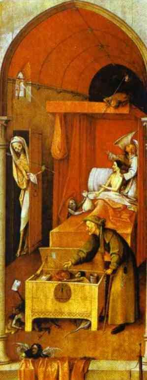

[🏠 Home](../../index.md)

# August 10

## 🧑‍🎨 Painting of the day

[Hieronymus Bosch](http://en.wikipedia.org/wiki/Hieronymus_Bosch) (Northern Renaissance)

<button class="btn btn-success"
onclick=" window.open('https://lens.google.com/uploadbyurl?url=https://iretes.github.io/one-a-day/data/img/Hieronymus_Bosch_2.jpg','_blank')">
Search with Google Lens
</button>

## 🎼 Song of the day

> *Should I Stay or Should I Go*
by The Clash

 Written by The Clash.

Released in May , 1982.

<button class="btn btn-success"
onclick=" window.open('http://www.youtube.com/search?q=Should I Stay or Should I Go by The Clash','_blank')">
Search on YouTube
</button>

## 🏛️ UNESCO heritage site of the day

> *City of Quito*, Ecuador

Quito, the capital of Ecuador, was founded in the 16th century on the ruins of an Inca city and stands at an altitude of 2,850 m. Despite the 1917 earthquake, the city has the best-preserved, least altered historic centre in Latin America. The monasteries of San Francisco and Santo Domingo, and the Church and Jesuit College of La Compañía, with their rich interiors, are pure examples of the 'Baroque school of Quito', which is a fusion of Spanish, Italian, Moorish, Flemish and indigenous art.

<button class="btn btn-success"
onclick=" window.open('http://www.google.com/search?q=City of Quito','_blank')">
Search on Google
</button>

## 🗺️ Place of the day

<iframe
src="https://www.mapcrunch.com"
name="mapcrunch"
width="500"
height="500"
allowTransparency="true"
scrolling="no"
frameborder="0"
>
</iframe>
## 🎨 Color of the day

> *[Periwinkle](https://en.wikipedia.org/wiki/Periwinkle_(color))*

&#9632;

## 🌿 Plant of the day

> *horse nettle*

<button class="btn btn-success"
onclick=" window.open('http://www.google.com/search?q=horse nettle','_blank')">
Search on Google
</button>

## 🧑‍🔬 Scientific discovery of the day

> *1910: Williamina Fleming: the first white dwarf, 40 Eridani B*

<button class="btn btn-success"
onclick=" window.open('http://www.google.com/search?q=1910: Williamina Fleming: the first white dwarf, 40 Eridani B','_blank')">
Search on Google
</button>

## 💭 Philosophical concept of the day

> *[Rule of Rescue](https://en.wikipedia.org/wiki/Rule_of_Rescue)*

## 🗣️ Saying of the day

> *Bandy words *

To
argue persistently.
