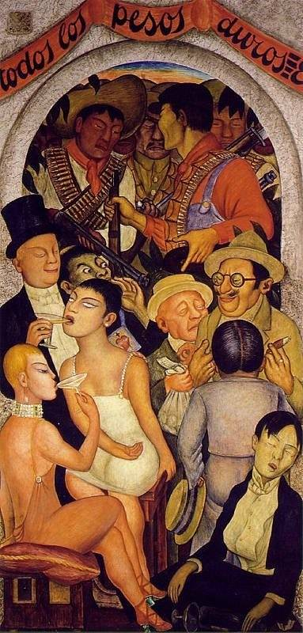

[🏠 Home](../../index.md)

# August 12

## 🧑‍🎨 Painting of the day

[Diego Rivera](http://en.wikipedia.org/wiki/Diego_Rivera) (Social Realism, Muralism)

<button class="btn btn-success"
onclick=" window.open('https://lens.google.com/uploadbyurl?url=https://iretes.github.io/one-a-day/data/img/Diego_Rivera_7.jpg','_blank')">
Search with Google Lens
</button>

## 🎼 Song of the day

> *Hoochie Coochie Man*
by Muddy Waters

 Written by Willie Dixon.

Released in Jan. , 1954.

<button class="btn btn-success"
onclick=" window.open('http://www.youtube.com/search?q=Hoochie Coochie Man by Muddy Waters','_blank')">
Search on YouTube
</button>

## 🏛️ UNESCO heritage site of the day

> *Swiss Alps Jungfrau-Aletsch*, Switzerland

The extension of the natural World Heritage property of Jungfrau - Aletsch - Bietschhorn (first inscribed in 2001), expands the site to the east and west, bringing its surface area up to 82,400 ha., up from 53,900. The site provides an outstanding example of the formation of the High Alps, including the most glaciated part of the mountain range and the largest glacier in Eurasia. It features a wide diversity of ecosystems, including successional stages due particularly to the retreat of glaciers resulting from climate change. The site is of outstanding universal value both for its beauty and for the wealth of information it contains about the formation of mountains and glaciers, as well as ongoing climate change. It is also invaluable in terms of the ecological and biological processes it illustrates, notably through plan succession. Its impressive landscape has played an important role in European art, literature, mountaineering and alpine tourism.

<button class="btn btn-success"
onclick=" window.open('http://www.google.com/search?q=Swiss Alps Jungfrau-Aletsch','_blank')">
Search on Google
</button>

## 🗺️ Place of the day

<iframe
src="https://www.mapcrunch.com"
name="mapcrunch"
width="500"
height="500"
allowTransparency="true"
scrolling="no"
frameborder="0"
>
</iframe>
## 🎨 Color of the day

> *[Violet (web)](https://en.wikipedia.org/wiki/Shades_of_violet#Web_color_&quot;violet&quot;)*

&#9632;

## 🌿 Plant of the day

> *spanish oak*

<button class="btn btn-success"
onclick=" window.open('http://www.google.com/search?q=spanish oak','_blank')">
Search on Google
</button>

## 🧑‍🔬 Scientific discovery of the day

> *3rd century BC: Archimedes discovers the sum/difference identity for trigonometric functions in the form of the "Theorem of Broken Chords".*

<button class="btn btn-success"
onclick=" window.open('http://www.google.com/search?q=3rd century BC: Archimedes discovers the sum/difference identity for trigonometric functions in the form of the Theorem of Broken Chords.','_blank')"> 
Search on Google
</button>

## 💭 Philosophical concept of the day

> *[Dharma](https://en.wikipedia.org/wiki/Dharma)*

## 🗣️ Saying of the day

> *All the tea in China - Not for *

Not at any price.

## 🏳️‍🌈 International day

International Youth Day.