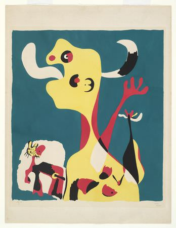

[🏠 Home](../../index.md)

# August 13

## 🧑‍🎨 Painting of the day

[Joan Miro](https://en.wikipedia.org/wiki/Joan_Miró) (Surrealism)

<button class="btn btn-success"
onclick=" window.open('https://lens.google.com/uploadbyurl?url=https://iretes.github.io/one-a-day/data/img/Joan_Miro_5.jpg','_blank')">
Search with Google Lens
</button>

## 🎼 Song of the day

> *Dance to the Music*
by Sly and the Family Stone

 Written by Sylvester Stewart (Sly Stone).

Released in Jan. , 1968.

<button class="btn btn-success"
onclick=" window.open('http://www.youtube.com/search?q=Dance to the Music by Sly and the Family Stone','_blank')">
Search on YouTube
</button>

## 🏛️ UNESCO heritage site of the day

> *Head-Smashed-In Buffalo Jump*, Canada

In south-west Alberta, the remains of marked trails and an aboriginal camp, and a tumulus where vast quantities of buffalo (American Bison) skeletons can still be found, are evidence of a custom practised by aboriginal peoples of the North American plains for nearly 6,000 years. Using their excellent knowledge of the topography and of buffalo behaviour, they killed their prey by chasing them over a precipice; the carcasses were later carved up in the camp below.

<button class="btn btn-success"
onclick=" window.open('http://www.google.com/search?q=Head-Smashed-In Buffalo Jump','_blank')">
Search on Google
</button>

## 🗺️ Place of the day

<iframe
src="https://www.mapcrunch.com"
name="mapcrunch"
width="500"
height="500"
allowTransparency="true"
scrolling="no"
frameborder="0"
>
</iframe>
## 🎨 Color of the day

> *[Bole](https://en.wikipedia.org/wiki/Bole_(color))*

&#9632;

## 🌿 Plant of the day

> *ivy*

<button class="btn btn-success"
onclick=" window.open('http://www.google.com/search?q=ivy','_blank')">
Search on Google
</button>

## 🧑‍🔬 Scientific discovery of the day

> *1998: Supernova Cosmology Project and the High-Z Supernova Search Team: discovery of the accelerated expansion of the Universe and dark energy*

<button class="btn btn-success"
onclick=" window.open('http://www.google.com/search?q=1998: Supernova Cosmology Project and the High-Z Supernova Search Team: discovery of the accelerated expansion of the Universe and dark energy','_blank')"> 
Search on Google
</button>

## 💭 Philosophical concept of the day

> *[Chakra](https://en.wikipedia.org/wiki/Chakra)*

## 🗣️ Saying of the day

> *The tail wagging the dog*

An item of minor importance dominating a situation. 
