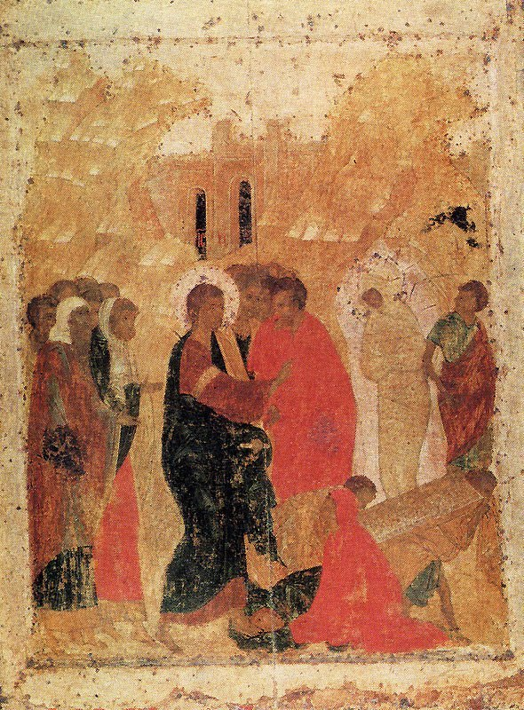

[🏠 Home](../../index.md)

# August 15

## 🧑‍🎨 Painting of the day

[Andrei Rublev](http://en.wikipedia.org/wiki/Andrei_Rublev) (Byzantine Art)

<button class="btn btn-success"
onclick=" window.open('https://lens.google.com/uploadbyurl?url=https://iretes.github.io/one-a-day/data/img/Andrei_Rublev_4.jpg','_blank')">
Search with Google Lens
</button>

## 🎼 Song of the day

> *Walk on the Wild Side*
by Lou Reed

 Written by Reed.

Released in Dec. , 1972.

<button class="btn btn-success"
onclick=" window.open('http://www.youtube.com/search?q=Walk on the Wild Side by Lou Reed','_blank')">
Search on YouTube
</button>

## 🏛️ UNESCO heritage site of the day

> *Giant's Causeway and Causeway Coast*, United Kingdom of Great Britain and Northern Ireland

The Giant's Causeway lies at the foot of the basalt cliffs along the sea coast on the edge of the Antrim plateau in Northern Ireland. It is made up of some 40,000 massive black basalt columns sticking out of the sea. The dramatic sight has inspired legends of giants striding over the sea to Scotland. Geological studies of these formations over the last 300 years have greatly contributed to the development of the earth sciences, and show that this striking landscape was caused by volcanic activity during the Tertiary, some 50–60 million years ago.

<button class="btn btn-success"
onclick=" window.open('http://www.google.com/search?q=Giant s Causeway and Causeway Coast','_blank')">
Search on Google
</button>

## 🗺️ Place of the day

<iframe
src="https://www.mapcrunch.com"
name="mapcrunch"
width="500"
height="500"
allowTransparency="true"
scrolling="no"
frameborder="0"
>
</iframe>
## 🎨 Color of the day

> *[Illuminating emerald](https://en.wikipedia.org/wiki/List_of_Crayola_crayon_colors#Metallic_FX)*

&#9632;

## 🌿 Plant of the day

> *possumhaw*

<button class="btn btn-success"
onclick=" window.open('http://www.google.com/search?q=possumhaw','_blank')">
Search on Google
</button>

## 🧑‍🔬 Scientific discovery of the day

> *1888: Friedrich Reinitzer discovers liquid crystals.*

<button class="btn btn-success"
onclick=" window.open('http://www.google.com/search?q=1888: Friedrich Reinitzer discovers liquid crystals.','_blank')"> 
Search on Google
</button>

## 💭 Philosophical concept of the day

> *[Problem of other minds](https://en.wikipedia.org/wiki/Problem_of_other_minds)*

## 🗣️ Saying of the day

> *A norange*

In 1914 the Danish grammarian Otto Jespersen coined the term 'metanalysis'. That's rather a dry start to a piece on what is a lively and intriguing facet of the English language. To find out what prompted Jespersen to believe that we needed a new word, let's bring in a stage prop - the humble orange. 
