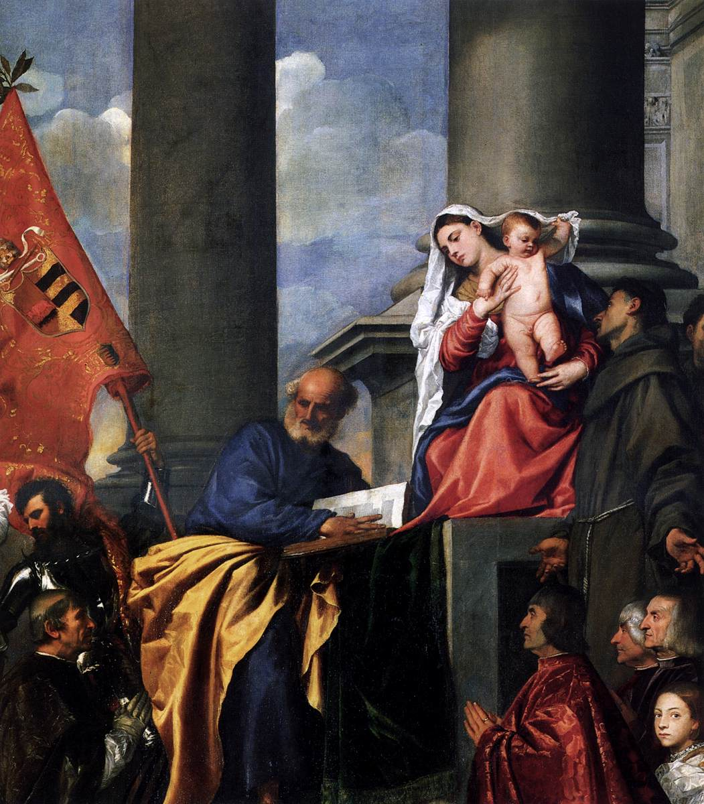

[🏠 Home](../../index.md)

# August 16

## 🧑‍🎨 Painting of the day

[Titian](http://en.wikipedia.org/wiki/Titian) (High Renaissance, Mannerism)

<button class="btn btn-success"
onclick=" window.open('https://lens.google.com/uploadbyurl?url=https://iretes.github.io/one-a-day/data/img/Titian_7.jpg','_blank')">
Search with Google Lens
</button>

## 🎼 Song of the day

> *Walk Away Renee*
by The Left Banke

 Written by Michael Brown, Bob Calilli, Tony Sansone.

Released in Sept. , 1966.

<button class="btn btn-success"
onclick=" window.open('http://www.youtube.com/search?q=Walk Away Renee by The Left Banke','_blank')">
Search on YouTube
</button>

## 🏛️ UNESCO heritage site of the day

> *St Mary's Cathedral and St Michael's Church at Hildesheim*, Germany

St Michael's Church was built between 1010 and 1020 on a symmetrical plan with two apses that was characteristic of Ottonian Romanesque art in Old Saxony. Its interior, in particular the wooden ceiling and painted stucco-work, its famous bronze doors and the Bernward bronze column, are – together with the treasures of St Mary's Cathedral – of exceptional interest as examples of the Romanesque churches of the Holy Roman Empire.

<button class="btn btn-success"
onclick=" window.open('http://www.google.com/search?q=St Mary s Cathedral and St Michael s Church at Hildesheim','_blank')">
Search on Google
</button>

## 🗺️ Place of the day

<iframe
src="https://www.mapcrunch.com"
name="mapcrunch"
width="500"
height="500"
allowTransparency="true"
scrolling="no"
frameborder="0"
>
</iframe>
## 🎨 Color of the day

> *[Old burgundy](https://en.wikipedia.org/wiki/Burgundy_(color)#Old_burgundy)*

&#9632;

## 🌿 Plant of the day

> *blue of the heavens*

<button class="btn btn-success"
onclick=" window.open('http://www.google.com/search?q=blue of the heavens','_blank')">
Search on Google
</button>

## 🧑‍🔬 Scientific discovery of the day

> *1948: Claude Elwood Shannon: 'A mathematical theory of communication' a seminal paper in Information theory.*

<button class="btn btn-success"
onclick=" window.open('http://www.google.com/search?q=1948: Claude Elwood Shannon:  A mathematical theory of communication  a seminal paper in Information theory.','_blank')"> 
Search on Google
</button>

## 💭 Philosophical concept of the day

> *[Necessary and sufficient condition](https://en.wikipedia.org/wiki/Necessary_and_sufficient_condition)*

## 🗣️ Saying of the day

> *Dressed to the nines*

To be 'dressed to the nines' is to be dressed flamboyantly or smartly.
