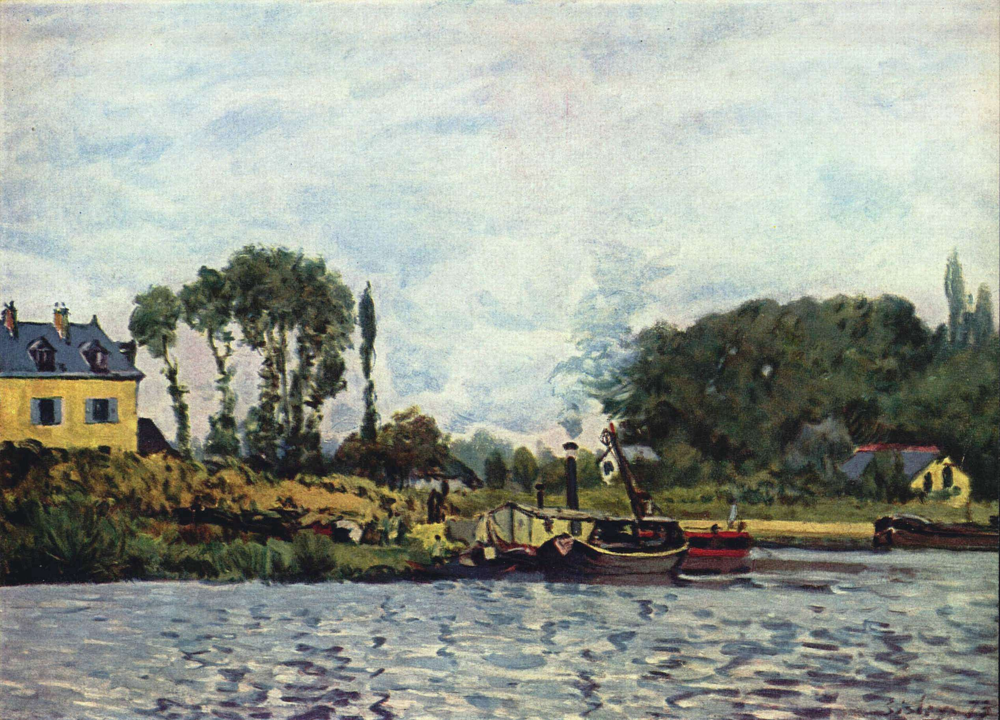

[🏠 Home](../../index.md)

# August 19

## 🧑‍🎨 Painting of the day

[Alfred Sisley](http://en.wikipedia.org/wiki/Alfred_Sisley) (Impressionism)

<button class="btn btn-success"
onclick=" window.open('https://lens.google.com/uploadbyurl?url=https://iretes.github.io/one-a-day/data/img/Alfred_Sisley_7.jpg','_blank')">
Search with Google Lens
</button>

## 🎼 Song of the day

> *Jolene*
by Dolly Parton

 Written by Parton.

Released in Jan. , 1974.

<button class="btn btn-success"
onclick=" window.open('http://www.youtube.com/search?q=Jolene by Dolly Parton','_blank')">
Search on YouTube
</button>

## 🏛️ UNESCO heritage site of the day

> *Palaces and Parks of Potsdam and Berlin*, Germany

With 500 ha of parks and 150 buildings constructed between 1730 and 1916, Potsdam's complex of palaces and parks forms an artistic whole, whose eclectic nature reinforces its sense of uniqueness. It extends into the district of Berlin-Zehlendorf, with the palaces and parks lining the banks of the River Havel and Lake Glienicke. Voltaire stayed at the Sans-Souci Palace, built under Frederick II between 1745 and 1747.

<button class="btn btn-success"
onclick=" window.open('http://www.google.com/search?q=Palaces and Parks of Potsdam and Berlin','_blank')">
Search on Google
</button>

## 🗺️ Place of the day

<iframe
src="https://www.mapcrunch.com"
name="mapcrunch"
width="500"
height="500"
allowTransparency="true"
scrolling="no"
frameborder="0"
>
</iframe>
## 🎨 Color of the day

> *[Patriarch](https://en.wikipedia.org/wiki/Shades_of_purple#Purple_(HTML/CSS_color)_(patriarch))*

&#9632;

## 🌿 Plant of the day

> *cane ash*

<button class="btn btn-success"
onclick=" window.open('http://www.google.com/search?q=cane ash','_blank')">
Search on Google
</button>

## 🧑‍🔬 Scientific discovery of the day

> *2020: 5G became increasingly widespread.*

<button class="btn btn-success"
onclick=" window.open('http://www.google.com/search?q=2020: 5G became increasingly widespread.','_blank')"> 
Search on Google
</button>

## 💭 Philosophical concept of the day

> *[Laïcité](https://en.wikipedia.org/wiki/La%C3%AFcit%C3%A9)*

## 🗣️ Saying of the day

> *Rhyming slang*

A type of slang in which  words are replaced by  words or phrases they rhyme with. 

## 🏳️‍🌈 International day

World Humanitarian Day.