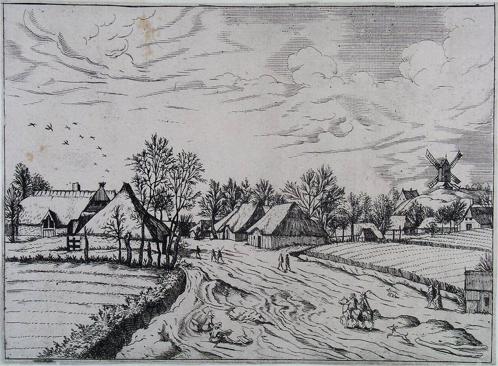

[🏠 Home](../../index.md)

# August 20

## 🧑‍🎨 Painting of the day

[Pieter Bruegel](http://en.wikipedia.org/wiki/Pieter_Bruegel_the_Elder) (Northern Renaissance)

<button class="btn btn-success"
onclick=" window.open('https://lens.google.com/uploadbyurl?url=https://iretes.github.io/one-a-day/data/img/Pieter_Bruegel_3.jpg','_blank')">
Search with Google Lens
</button>

## 🎼 Song of the day

> *Do You Believe in Magic*
by The Lovin' Spoonful

 Written by John Sebastian.

Released in July , 1965.

<button class="btn btn-success"
onclick=" window.open('http://www.youtube.com/search?q=Do You Believe in Magic by The Lovin  Spoonful','_blank')">
Search on YouTube
</button>

## 🏛️ UNESCO heritage site of the day

> *Fagus Factory in Alfeld*, Germany

Fagus Factory in Alfeld is a 10-building complex - began around 1910 to the design of Walter Gropius, which is a landmark in the development of modern architecture and industrial design. Serving all stages of manufacture, storage and dispatch of lasts used by the shoe industry, the complex, which is still operational today, is situated in Alfeld an der Leine in Lower Saxony. With its groundbreaking vast expanses of glass panels and functionalist aesthetics, the complex foreshadowed the work of the Bauhaus school and is a landmark in the development of architecture in Europe and North America.

<button class="btn btn-success"
onclick=" window.open('http://www.google.com/search?q=Fagus Factory in Alfeld','_blank')">
Search on Google
</button>

## 🗺️ Place of the day

<iframe
src="https://www.mapcrunch.com"
name="mapcrunch"
width="500"
height="500"
allowTransparency="true"
scrolling="no"
frameborder="0"
>
</iframe>
## 🎨 Color of the day

> *[Slimy green](https://en.wikipedia.org/wiki/List_of_Crayola_crayon_colors#Heads_&#39;n_Tails)*

&#9632;

## 🌿 Plant of the day

> *buffalo weed*

<button class="btn btn-success"
onclick=" window.open('http://www.google.com/search?q=buffalo weed','_blank')">
Search on Google
</button>

## 🧑‍🔬 Scientific discovery of the day

> *200 BC: Apollonius of Perga discovers Apollonius's theorem.*

<button class="btn btn-success"
onclick=" window.open('http://www.google.com/search?q=200 BC: Apollonius of Perga discovers Apollonius s theorem.','_blank')"> 
Search on Google
</button>

## 💭 Philosophical concept of the day

> *[Unity of science](https://en.wikipedia.org/wiki/Unity_of_science)*

## 🗣️ Saying of the day

> *Rough diamond*

Someone who is basically good hearted but lacking social graces and respect for the law.
