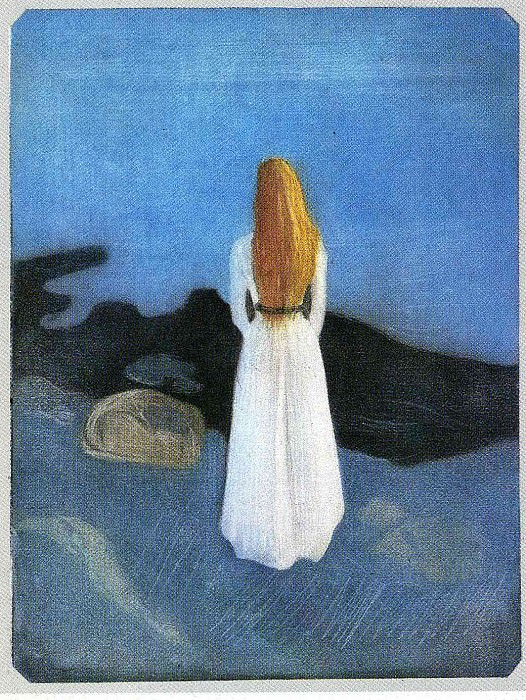

[🏠 Home](../../index.md)

# August 21

## 🧑‍🎨 Painting of the day

[Edvard Munch](https://en.wikipedia.org/wiki/Edvard_Munch) (Symbolism, Expressionism)

<button class="btn btn-success"
onclick=" window.open('https://lens.google.com/uploadbyurl?url=https://iretes.github.io/one-a-day/data/img/Edvard_Munch_2.jpg','_blank')">
Search with Google Lens
</button>

## 🎼 Song of the day

> *Your Cheatin Heart*
by Hank Williams

 Written by Williams, Fred Rose.

Released in Jan. , 1953.

<button class="btn btn-success"
onclick=" window.open('http://www.youtube.com/search?q=Your Cheatin Heart by Hank Williams','_blank')">
Search on YouTube
</button>

## 🏛️ UNESCO heritage site of the day

> *Chaîne des Puys - Limagne fault tectonic arena*, France

Situated in the centre of France, the property comprises the long Limagne fault, the alignments of the Chaîne des Puys volcanoes and the inverted relief of the Montagne de la Serre. It is an emblematic segment of the West European Rift, created in the aftermath of the formation of the Alps, 35 million years ago. The geological features of the property demonstrate how the continental crust cracks, then collapses, allowing deep magma to rise and cause uplifting at the surface. The property is an exceptional illustration of continental break-up – or rifting – which is one of the five major stages of plate tectonics.

<button class="btn btn-success"
onclick=" window.open('http://www.google.com/search?q=Chaîne des Puys - Limagne fault tectonic arena','_blank')">
Search on Google
</button>

## 🗺️ Place of the day

<iframe
src="https://www.mapcrunch.com"
name="mapcrunch"
width="500"
height="500"
allowTransparency="true"
scrolling="no"
frameborder="0"
>
</iframe>
## 🎨 Color of the day

> *[Orange](https://en.wikipedia.org/wiki/Orange_(colour))*

&#9632;

## 🌿 Plant of the day

> *crows nest*

<button class="btn btn-success"
onclick=" window.open('http://www.google.com/search?q=crows nest','_blank')">
Search on Google
</button>

## 🧑‍🔬 Scientific discovery of the day

> *850: Mahāvīra derives the expression for the binomial coefficient in terms of factorials.*

<button class="btn btn-success"
onclick=" window.open('http://www.google.com/search?q=850: Mahāvīra derives the expression for the binomial coefficient in terms of factorials.','_blank')">
Search on Google
</button>

## 💭 Philosophical concept of the day

> *[Virtue](https://en.wikipedia.org/wiki/Virtue)*

## 🗣️ Saying of the day

> *The course of true love never did run smooth*

Literal meaning.

## 🏳️‍🌈 International day

International Day of Remembrance and Tribute to the Victims of Terrorism.