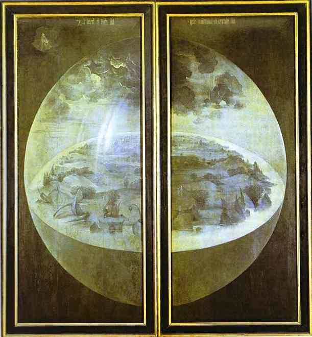

[🏠 Home](../../index.md)

# August 22

## 🧑‍🎨 Painting of the day

[Hieronymus Bosch](http://en.wikipedia.org/wiki/Hieronymus_Bosch) (Northern Renaissance)

<button class="btn btn-success"
onclick=" window.open('https://lens.google.com/uploadbyurl?url=https://iretes.github.io/one-a-day/data/img/Hieronymus_Bosch_3.jpg','_blank')">
Search with Google Lens
</button>

## 🎼 Song of the day

> *Rockin in the Free World*
by Neil Young

 Written by Young.

Released in Oct. , 1989.

<button class="btn btn-success"
onclick=" window.open('http://www.youtube.com/search?q=Rockin in the Free World by Neil Young','_blank')">
Search on YouTube
</button>

## 🏛️ UNESCO heritage site of the day

> *Renaissance Monumental Ensembles of Úbeda and Baeza*, Spain

The urban morphology of the two small cities of Úbeda and Baeza in southern Spain dates back to the Moorish 9th century and to the Reconquista in the 13th century. An important development took place in the 16th century, when the cities were subject to renovation along the lines of the emerging Renaissance. This planning intervention was part of the introduction into Spain of new humanistic ideas from Italy, which went on to have a great influence on the architecture of Latin America.

<button class="btn btn-success"
onclick=" window.open('http://www.google.com/search?q=Renaissance Monumental Ensembles of Úbeda and Baeza','_blank')">
Search on Google
</button>

## 🗺️ Place of the day

<iframe
src="https://www.mapcrunch.com"
name="mapcrunch"
width="500"
height="500"
allowTransparency="true"
scrolling="no"
frameborder="0"
>
</iframe>
## 🎨 Color of the day

> *[Medium slate blue](https://en.wikipedia.org/wiki/X11_color_names#Color_names)*

&#9632;

## 🌿 Plant of the day

> *cabbage*

<button class="btn btn-success"
onclick=" window.open('http://www.google.com/search?q=cabbage','_blank')">
Search on Google
</button>

## 🧑‍🔬 Scientific discovery of the day

> *628: Brahmagupta produces an infinite (but not exhaustive) number of solutions to Pell's equation.*

<button class="btn btn-success"
onclick=" window.open('http://www.google.com/search?q=628: Brahmagupta produces an infinite (but not exhaustive) number of solutions to Pell s equation.','_blank')">
Search on Google
</button>

## 💭 Philosophical concept of the day

> *[Evil](https://en.wikipedia.org/wiki/Evil)*

## 🗣️ Saying of the day

> *It's all grist to the mill*

All things are a potential source of profit or advantage.

## 🏳️‍🌈 International day

International Day Commemorating the Victims of Acts of Violence Based on Religion or Belief.