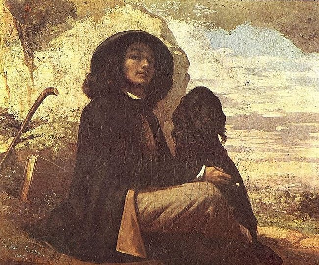

[🏠 Home](../../index.md)

# August 24

## 🧑‍🎨 Painting of the day

[Gustave Courbet](https://en.wikipedia.org/wiki/Gustave_Courbet) (Realism)

<button class="btn btn-success"
onclick=" window.open('https://lens.google.com/uploadbyurl?url=https://iretes.github.io/one-a-day/data/img/Gustave_Courbet_1.jpg','_blank')">
Search with Google Lens
</button>

## 🎼 Song of the day

> *Caroline*
by The Beach Boys

 Written by Brian Wilson, Tony Asher.

Released in March , 1966.

<button class="btn btn-success"
onclick=" window.open('http://www.youtube.com/search?q=Caroline by The Beach Boys','_blank')">
Search on YouTube
</button>

## 🏛️ UNESCO heritage site of the day

> *Curonian Spit*, Lithuania,Russian Federation

Human habitation of this elongated sand dune peninsula, 98 km long and 0.4-4 km wide, dates back to prehistoric times. Throughout this period it has been threatened by the natural forces of wind and waves. Its survival to the present day has been made possible only as a result of ceaseless human efforts to combat the erosion of the Spit, dramatically illustrated by continuing stabilisation and reforestation projects.

<button class="btn btn-success"
onclick=" window.open('http://www.google.com/search?q=Curonian Spit','_blank')">
Search on Google
</button>

## 🗺️ Place of the day

<iframe
src="https://www.mapcrunch.com"
name="mapcrunch"
width="500"
height="500"
allowTransparency="true"
scrolling="no"
frameborder="0"
>
</iframe>
## 🎨 Color of the day

> *[Wine](https://en.wikipedia.org/wiki/Wine_(color))*

&#9632;

## 🌿 Plant of the day

> *swinies*

<button class="btn btn-success"
onclick=" window.open('http://www.google.com/search?q=swinies','_blank')">
Search on Google
</button>

## 🧑‍🔬 Scientific discovery of the day

> *500 BC: Hippasus, a Pythagorean, discovers irrational numbers.*

<button class="btn btn-success"
onclick=" window.open('http://www.google.com/search?q=500 BC: Hippasus, a Pythagorean, discovers irrational numbers.','_blank')">
Search on Google
</button>

## 💭 Philosophical concept of the day

> *[Four causes](https://en.wikipedia.org/wiki/Four_causes)*

## 🗣️ Saying of the day

> *Cut of your jib - The *

One's general appearance and demeanour.
