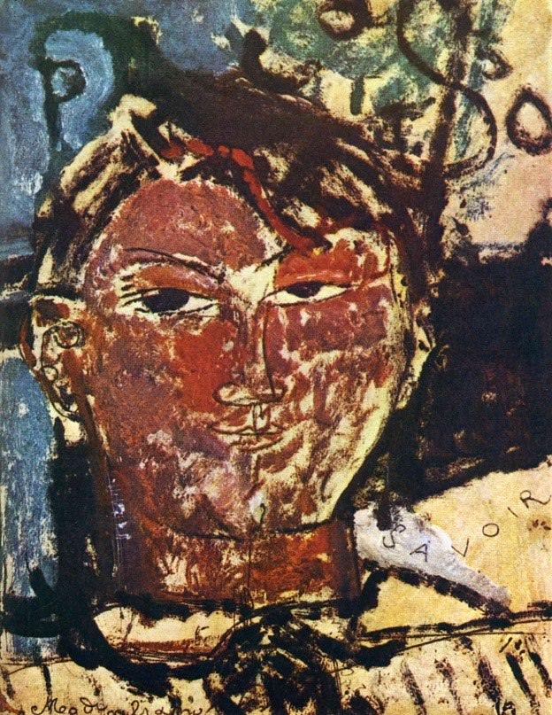

[🏠 Home](../../index.md)

# August 25

## 🧑‍🎨 Painting of the day

[Amedeo Modigliani](http://en.wikipedia.org/wiki/Amedeo_Modigliani) (Expressionism)

<button class="btn btn-success"
onclick=" window.open('https://lens.google.com/uploadbyurl?url=https://iretes.github.io/one-a-day/data/img/Amedeo_Modigliani_3.jpg','_blank')">
Search with Google Lens
</button>

## 🎼 Song of the day

> *96 Tears*
by ? and the Mysterians

 Written by Rudy Martinez.

Released in Sept. , 1966.

<button class="btn btn-success"
onclick=" window.open('http://www.youtube.com/search?q=96 Tears by ? and the Mysterians','_blank')">
Search on YouTube
</button>

## 🏛️ UNESCO heritage site of the day

> *Su Nuraxi di Barumini*, Italy

During the late 2nd millennium B.C. in the Bronze Age, a special type of defensive structure known as <em>nuraghi</em> (for which no parallel exists anywhere else in the world) developed on the island of Sardinia. The complex consists of circular defensive towers in the form of truncated cones built of dressed stone, with corbel-vaulted internal chambers. The complex at Barumini, which was extended and reinforced in the first half of the 1st millennium under Carthaginian pressure, is the finest and most complete example of this remarkable form of prehistoric architecture.

<button class="btn btn-success"
onclick=" window.open('http://www.google.com/search?q=Su Nuraxi di Barumini','_blank')">
Search on Google
</button>

## 🗺️ Place of the day

<iframe
src="https://www.mapcrunch.com"
name="mapcrunch"
width="500"
height="500"
allowTransparency="true"
scrolling="no"
frameborder="0"
>
</iframe>
## 🎨 Color of the day

> *[Middle purple](https://en.wikipedia.org/wiki/History_of_Crayola_crayons#Munsell_Crayola,_1926–1944)*

&#9632;

## 🌿 Plant of the day

> *meadow holly*

<button class="btn btn-success"
onclick=" window.open('http://www.google.com/search?q=meadow holly','_blank')">
Search on Google
</button>

## 🧑‍🔬 Scientific discovery of the day

> *300 BC: Euclid proves the infinitude of primes.*

<button class="btn btn-success"
onclick=" window.open('http://www.google.com/search?q=300 BC: Euclid proves the infinitude of primes.','_blank')"> 
Search on Google
</button>

## 💭 Philosophical concept of the day

> *[Mansion of Many Apartments](https://en.wikipedia.org/wiki/Mansion_of_Many_Apartments)*

## 🗣️ Saying of the day

> *To sleep: perchance to dream: ay, there's the rub*

This line is from the celebrated 'To be, or not to be' speech in Shakespeare's Hamlet, 1602:
