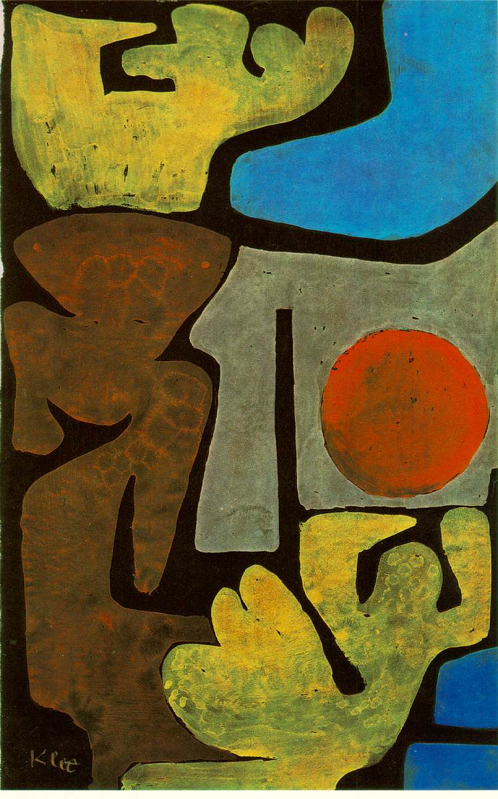

[🏠 Home](../../index.md)

# August 26

## 🧑‍🎨 Painting of the day

[Paul Klee](https://en.wikipedia.org/wiki/Paul_Klee) (Expressionism, Abstractionism, Surrealism)

<button class="btn btn-success"
onclick=" window.open('https://lens.google.com/uploadbyurl?url=https://iretes.github.io/one-a-day/data/img/Paul_Klee_4.jpg','_blank')">
Search with Google Lens
</button>

## 🎼 Song of the day

> *In My Room*
by The Beach Boys

 Written by Brian Wilson, Gary Usher.

Released in Sept. , 1963.

<button class="btn btn-success"
onclick=" window.open('http://www.youtube.com/search?q=In My Room by The Beach Boys','_blank')">
Search on YouTube
</button>

## 🏛️ UNESCO heritage site of the day

> *Comoé National Park*, Côte d'Ivoire

One of the largest protected areas in West Africa, this park is characterized by its great plant diversity. Due to the presence of the Comoé river, it contains plants which are normally only found much farther south, such as shrub savannahs and patches of thick rainforest.

<button class="btn btn-success"
onclick=" window.open('http://www.google.com/search?q=Comoé National Park','_blank')">
Search on Google
</button>

## 🗺️ Place of the day

<iframe
src="https://www.mapcrunch.com"
name="mapcrunch"
width="500"
height="500"
allowTransparency="true"
scrolling="no"
frameborder="0"
>
</iframe>
## 🎨 Color of the day

> *[Blast-off bronze](https://en.wikipedia.org/wiki/Bronze_(color)#Blast-off_bronze)*

&#9632;

## 🌿 Plant of the day

> *devils bite*

<button class="btn btn-success"
onclick=" window.open('http://www.google.com/search?q=devils bite','_blank')">
Search on Google
</button>

## 🧑‍🔬 Scientific discovery of the day

> *1824: Carnot: described the Carnot cycle, the idealized heat engine.*

<button class="btn btn-success"
onclick=" window.open('http://www.google.com/search?q=1824: Carnot: described the Carnot cycle, the idealized heat engine.','_blank')"> 
Search on Google
</button>

## 💭 Philosophical concept of the day

> *[Trilok (Jainism)](https://en.wikipedia.org/wiki/Trilok_(Jainism))*

## 🗣️ Saying of the day

> *Forlorn hope*

A hopeless or desperate enterprise.
