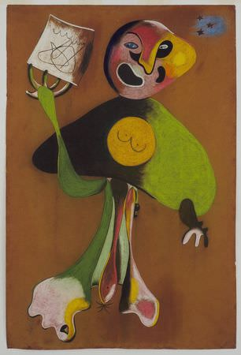

[🏠 Home](../../index.md)

# August 27

## 🧑‍🎨 Painting of the day

[Joan Miro](https://en.wikipedia.org/wiki/Joan_Miró) (Surrealism)

<button class="btn btn-success"
onclick=" window.open('https://lens.google.com/uploadbyurl?url=https://iretes.github.io/one-a-day/data/img/Joan_Miro_3.jpg','_blank')">
Search with Google Lens
</button>

## 🎼 Song of the day

> *Gloria*
by Them

 Written by Van Morrison.

Released in March , 1965.

<button class="btn btn-success"
onclick=" window.open('http://www.youtube.com/search?q=Gloria by Them','_blank')">
Search on YouTube
</button>

## 🏛️ UNESCO heritage site of the day

> *Luis Barragán House and Studio*, Mexico

Built in 1948, the House and Studio of architect Luis Barragán in the suburbs of Mexico City represents an outstanding example of the architect’s creative work in the post-Second World War period. The concrete building, totalling 1,161 m2, consists of a ground floor and two upper storeys, as well as a small private garden. Barragán’s work integrated modern and traditional artistic and vernacular currents and elements into a new synthesis, which has been greatly influential, especially in the contemporary design of gardens, plazas and landscapes.

<button class="btn btn-success"
onclick=" window.open('http://www.google.com/search?q=Luis Barragán House and Studio','_blank')">
Search on Google
</button>

## 🗺️ Place of the day

<iframe
src="https://www.mapcrunch.com"
name="mapcrunch"
width="500"
height="500"
allowTransparency="true"
scrolling="no"
frameborder="0"
>
</iframe>
## 🎨 Color of the day

> *[Cosmic latte](https://en.wikipedia.org/wiki/Cosmic_latte)*

&#9632;

## 🌿 Plant of the day

> *english oak*

<button class="btn btn-success"
onclick=" window.open('http://www.google.com/search?q=english oak','_blank')">
Search on Google
</button>

## 🧑‍🔬 Scientific discovery of the day

> *1948: Richard Feynman, Julian Schwinger, Sin-Itiro Tomonaga and Freeman Dyson: Quantum electrodynamics*

<button class="btn btn-success"
onclick=" window.open('http://www.google.com/search?q=1948: Richard Feynman, Julian Schwinger, Sin-Itiro Tomonaga and Freeman Dyson: Quantum electrodynamics','_blank')"> 
Search on Google
</button>

## 💭 Philosophical concept of the day

> *[Camp](https://en.wikipedia.org/wiki/Camp_(style))*

## 🗣️ Saying of the day

> *Point to point*

A
race, usually a horse-race, in a direct line across countryside. The term has also migrated to other areas which involve transit from one specific point to another; for example, direct air transport from one city to another and the 'P2P [Point to Point] Protocol' used in Internet communications. 
