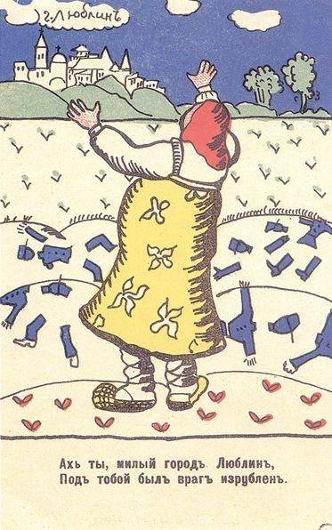

[🏠 Home](../../index.md)

# August 29

## 🧑‍🎨 Painting of the day

[Kazimir Malevich](http://en.wikipedia.org/wiki/Kazimir_Malevich) (Suprematism)

<button class="btn btn-success"
onclick=" window.open('https://lens.google.com/uploadbyurl?url=https://iretes.github.io/one-a-day/data/img/Kazimir_Malevich_6.jpg','_blank')">
Search with Google Lens
</button>

## 🎼 Song of the day

> *Reach Out*
by The Four Tops

 Written by Eddie Holland, Lamont Dozier, Brian Holland.

Released in Aug. , 1966.

<button class="btn btn-success"
onclick=" window.open('http://www.youtube.com/search?q=Reach Out by The Four Tops','_blank')">
Search on YouTube
</button>

## 🏛️ UNESCO heritage site of the day

> *Yin Xu*, China

The archaeological site of Yin Xu, close to Anyang City, some 500 km south of Beijing, is an ancient capital city of the late Shang Dynasty (1300 - 1046 BC). It testifies to the golden age of early Chinese culture, crafts and sciences, a time of great prosperity of the Chinese Bronze Age. A number of royal tombs and palaces, prototypes of later Chinese architecture, have been unearthed on the site, including the Palace and Royal Ancestral Shrines Area, with more than 80 house foundations, and the only tomb of a member of the royal family of the Shang Dynasty to have remained intact, the Tomb of Fu Hao. The large number and superb craftsmanship of the burial accessories found there bear testimony to the advanced level of Shang crafts industry. Inscriptions on oracle bones found in Yin Xu bear invaluable testimony to the development of one of the world’s oldest writing systems, ancient beliefs and social systems.

<button class="btn btn-success"
onclick=" window.open('http://www.google.com/search?q=Yin Xu','_blank')">
Search on Google
</button>

## 🗺️ Place of the day

<iframe
src="https://www.mapcrunch.com"
name="mapcrunch"
width="500"
height="500"
allowTransparency="true"
scrolling="no"
frameborder="0"
>
</iframe>
## 🎨 Color of the day

> *[Apricot](https://en.wikipedia.org/wiki/Apricot_(color))*

&#9632;

## 🌿 Plant of the day

> *swamp milkweed*

<button class="btn btn-success"
onclick=" window.open('http://www.google.com/search?q=swamp milkweed','_blank')">
Search on Google
</button>

## 🧑‍🔬 Scientific discovery of the day

> *300 BC: Euclid publishes the Elements, a compendium on classical Euclidean geometry, including: elementary theorems on circles, definitions of the centers of a triangle, the tangent-secant theorem, the law of sines and the law of cosines.*

<button class="btn btn-success"
onclick=" window.open('http://www.google.com/search?q=300 BC: Euclid publishes the Elements, a compendium on classical Euclidean geometry, including: elementary theorems on circles, definitions of the centers of a triangle, the tangent-secant theorem, the law of sines and the law of cosines.','_blank')"> 
Search on Google
</button>

## 💭 Philosophical concept of the day

> *[Hate speech](https://en.wikipedia.org/wiki/Hate_speech)*

## 🗣️ Saying of the day

> *Vicious circle*

A self-perpetuating process which returns to its starting point with no improvement from when it was begun. 

## 🏳️‍🌈 International day

International Day against Nuclear Tests.