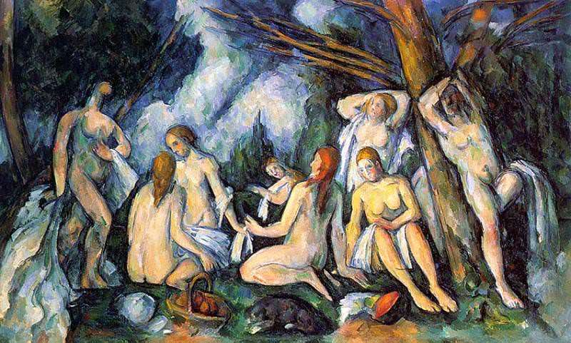

[🏠 Home](../../index.md)

# August 3

## 🧑‍🎨 Painting of the day

[Paul Cezanne](https://en.wikipedia.org/wiki/Paul_Cézanne) (Post-Impressionism)

<button class="btn btn-success"
onclick=" window.open('https://lens.google.com/uploadbyurl?url=https://iretes.github.io/one-a-day/data/img/Paul_Cezanne_5.jpg','_blank')">
Search with Google Lens
</button>

## 🎼 Song of the day

> *We Gotta Get Out of This Place*
by The Animals

 Written by Barry Mann, Cynthia Weil.

Released in Aug. , 1965.

<button class="btn btn-success"
onclick=" window.open('http://www.youtube.com/search?q=We Gotta Get Out of This Place by The Animals','_blank')">
Search on YouTube
</button>

## 🏛️ UNESCO heritage site of the day

> *Franciscan Missions in the Sierra Gorda of Querétaro*, Mexico

The five Franciscan missions of Sierra Gorda were built during the last phase of the conversion to Christianity of the interior of Mexico in the mid-18th century and became an important reference for the continuation of the evangelization of California, Arizona and Texas. The richly decorated church fa&ccedil;ades are of special interest as they represent an example of the joint creative efforts of the missionaries and the Indios. The rural settlements that grew around the missions have retained their vernacular character.

<button class="btn btn-success"
onclick=" window.open('http://www.google.com/search?q=Franciscan Missions in the Sierra Gorda of Querétaro','_blank')">
Search on Google
</button>

## 🗺️ Place of the day

<iframe
src="https://www.mapcrunch.com"
name="mapcrunch"
width="500"
height="500"
allowTransparency="true"
scrolling="no"
frameborder="0"
>
</iframe>
## 🎨 Color of the day

> *[Parchment](https://en.wikipedia.org/wiki/Shades_of_white#Parchment)*

&#9632;

## 🌿 Plant of the day

> *wild tansy*

<button class="btn btn-success"
onclick=" window.open('http://www.google.com/search?q=wild tansy','_blank')">
Search on Google
</button>

## 🧑‍🔬 Scientific discovery of the day

> *700 BC: Pell's equations are first studied by Baudhayana in India, the first diophantine equations known to be studied.*

<button class="btn btn-success"
onclick=" window.open('http://www.google.com/search?q=700 BC: Pell s equations are first studied by Baudhayana in India, the first diophantine equations known to be studied.','_blank')"> 
Search on Google
</button>

## 💭 Philosophical concept of the day

> *[Formal cause](https://en.wikipedia.org/wiki/Formal_cause)*

## 🗣️ Saying of the day

> *Barking mad*

Insane; intensely mad.
