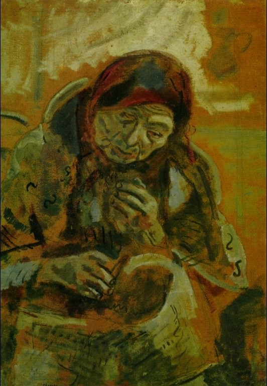

[🏠 Home](../../index.md)

# August 30

## 🧑‍🎨 Painting of the day

[Marc Chagall](http://en.wikipedia.org/wiki/Marc_Chagall) (Primitivism)

<button class="btn btn-success"
onclick=" window.open('https://lens.google.com/uploadbyurl?url=https://iretes.github.io/one-a-day/data/img/Marc_Chagall_1.jpg','_blank')">
Search with Google Lens
</button>

## 🎼 Song of the day

> *Lean on Me*
by Bill Withers

 Written by Withers.

Released in June , 1972.

<button class="btn btn-success"
onclick=" window.open('http://www.youtube.com/search?q=Lean on Me by Bill Withers','_blank')">
Search on YouTube
</button>

## 🏛️ UNESCO heritage site of the day

> *Rjukan-Notodden Industrial Heritage Site*, Norway

Located in a dramatic landscape of mountains, waterfalls and river valleys, the site comprises hydroelectric power plants, transmission lines, factories, transport systems and towns. The complex was established by the Norsk-Hydro Company to manufacture artificial fertilizer from nitrogen in the air. It was built to meet the Western world’s growing demand for agricultural production in the early 20th century. The company towns of Rjukan and Notodden show workers’ accommodation and social institutions linked by rail and ferry to ports where the fertilizer was loaded. The Rjukan-Notodden site manifests an exceptional combination of industrial assets and themes associated to the natural landscape. It stands out as an example of a new global industry in the early 20th century.

<button class="btn btn-success"
onclick=" window.open('http://www.google.com/search?q=Rjukan-Notodden Industrial Heritage Site','_blank')">
Search on Google
</button>

## 🗺️ Place of the day

<iframe
src="https://www.mapcrunch.com"
name="mapcrunch"
width="500"
height="500"
allowTransparency="true"
scrolling="no"
frameborder="0"
>
</iframe>
## 🎨 Color of the day

> *[Zinnwaldite brown](https://en.wikipedia.org/wiki/Zinnwaldite)*

&#9632;

## 🌿 Plant of the day

> *pennsylvania blackberry*

<button class="btn btn-success"
onclick=" window.open('http://www.google.com/search?q=pennsylvania blackberry','_blank')">
Search on Google
</button>

## 🧑‍🔬 Scientific discovery of the day

> *1994: Andrew Wiles proves Fermat's Last Theorem*

<button class="btn btn-success"
onclick=" window.open('http://www.google.com/search?q=1994: Andrew Wiles proves Fermat s Last Theorem','_blank')"> 
Search on Google
</button>

## 💭 Philosophical concept of the day

> *[Haecceity](https://en.wikipedia.org/wiki/Haecceity)*

## 🗣️ Saying of the day

> *No love lost*

'There's no love lost between them' is used to describe a relationship between two people who dislike each each.

## 🏳️‍🌈 International day

International Day of the Victims of Enforced Disappearances.