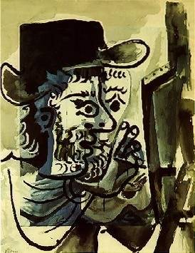

[🏠 Home](../../index.md)

# August 31

## 🧑‍🎨 Painting of the day

[Pablo Picasso](http://en.wikipedia.org/wiki/Pablo_Picasso) (Cubism)

<button class="btn btn-success"
onclick=" window.open('https://lens.google.com/uploadbyurl?url=https://iretes.github.io/one-a-day/data/img/Pablo_Picasso_6.jpg','_blank')">
Search with Google Lens
</button>

## 🎼 Song of the day

> *Try a Little Tenderness*
by Otis Redding

 Written by Jimmy Campbell, Reginald Connelly, Harry Woods.

Released in Dec. , 1966.

<button class="btn btn-success"
onclick=" window.open('http://www.youtube.com/search?q=Try a Little Tenderness by Otis Redding','_blank')">
Search on YouTube
</button>

## 🏛️ UNESCO heritage site of the day

> *Historic Villages of Korea: Hahoe and Yangdong*, Republic of Korea

Founded in the 14th-15th centuries, Hahoe and Yangdong are seen as the two most representative historic clan villages in the Republic of Korea. Their layout and location - sheltered by forested mountains and facing out onto a river and open agricultural fields – reflect the distinctive aristocratic Confucian culture of the early part of the Joseon Dynasty (1392-1910). The villages were located to provide both physical and spiritual nourishment from their surrounding landscapes. They include residences of the head families, together with substantial timber framed houses of other clan members, also pavilions, study halls, Confucian academies for learning, and clusters of one story mud-walled, thatched-roofed houses, formerly for commoners. The landscapes of mountains, trees and water around the village, framed in views from pavilions and retreats, were celebrated for their beauty by 17th and 18th century poets.

<button class="btn btn-success"
onclick=" window.open('http://www.google.com/search?q=Historic Villages of Korea: Hahoe and Yangdong','_blank')">
Search on Google
</button>

## 🗺️ Place of the day

<iframe
src="https://www.mapcrunch.com"
name="mapcrunch"
width="500"
height="500"
allowTransparency="true"
scrolling="no"
frameborder="0"
>
</iframe>
## 🎨 Color of the day

> *[International Klein Blue](https://en.wikipedia.org/wiki/Shades_of_Blue#International_Klein_Blue)*

&#9632;

## 🌿 Plant of the day

> *daisy*

<button class="btn btn-success"
onclick=" window.open('http://www.google.com/search?q=daisy','_blank')">
Search on Google
</button>

## 🧑‍🔬 Scientific discovery of the day

> *1865: Gregor Mendel: Mendel's laws of inheritance, basis for genetics.*

<button class="btn btn-success"
onclick=" window.open('http://www.google.com/search?q=1865: Gregor Mendel: Mendel s laws of inheritance, basis for genetics.','_blank')">
Search on Google
</button>

## 💭 Philosophical concept of the day

> *[A priori and a posteriori](https://en.wikipedia.org/wiki/A_priori_and_a_posteriori)*

## 🗣️ Saying of the day

> *Faith will move mountains*

Faith is immensely powerful. 

## 🏳️‍🌈 International day

International Day for People of African Descent.