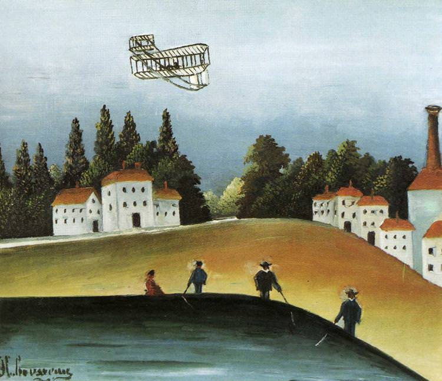

[🏠 Home](../../index.md)

# August 4

## 🧑‍🎨 Painting of the day

[Henri Rousseau](https://en.wikipedia.org/wiki/Henri_Rousseau) (Primitivism)

<button class="btn btn-success"
onclick=" window.open('https://lens.google.com/uploadbyurl?url=https://iretes.github.io/one-a-day/data/img/Henri_Rousseau_3.jpg','_blank')">
Search with Google Lens
</button>

## 🎼 Song of the day

> *Only the Lonely*
by Roy Orbison

 Written by Joe Melson, Orbison.

Released in May , 1960.

<button class="btn btn-success"
onclick=" window.open('http://www.youtube.com/search?q=Only the Lonely by Roy Orbison','_blank')">
Search on YouTube
</button>

## 🏛️ UNESCO heritage site of the day

> *Historic Centre of Sighişoara*, Romania

Founded by German craftsmen and merchants known as the Saxons of Transylvania, Sighişoara is a fine example of a small, fortified medieval town which played an important strategic and commercial role on the fringes of central Europe for several centuries.

<button class="btn btn-success"
onclick=" window.open('http://www.google.com/search?q=Historic Centre of Sighişoara','_blank')">
Search on Google
</button>

## 🗺️ Place of the day

<iframe
src="https://www.mapcrunch.com"
name="mapcrunch"
width="500"
height="500"
allowTransparency="true"
scrolling="no"
frameborder="0"
>
</iframe>
## 🎨 Color of the day

> *[Glossy grape](https://en.wikipedia.org/wiki/List_of_Crayola_crayon_colors#Silver_Swirls)*

&#9632;

## 🌿 Plant of the day

> *star of persia*

<button class="btn btn-success"
onclick=" window.open('http://www.google.com/search?q=star of persia','_blank')">
Search on Google
</button>

## 🧑‍🔬 Scientific discovery of the day

> *2020: NASA launched the Perseverance rover and Ingenuity helicopter drone on 30 July 2020 as part of their Mars 2020 mission to search for signs of ancient life on Mars.*

<button class="btn btn-success"
onclick=" window.open('http://www.google.com/search?q=2020: NASA launched the Perseverance rover and Ingenuity helicopter drone on 30 July 2020 as part of their Mars 2020 mission to search for signs of ancient life on Mars.','_blank')">
Search on Google
</button>

## 💭 Philosophical concept of the day

> *[Biofact](https://en.wikipedia.org/wiki/Biofact_(philosophy))*

## 🗣️ Saying of the day

> *Set one's cap at*

Said of a woman who determines to gain the affections of a man.
