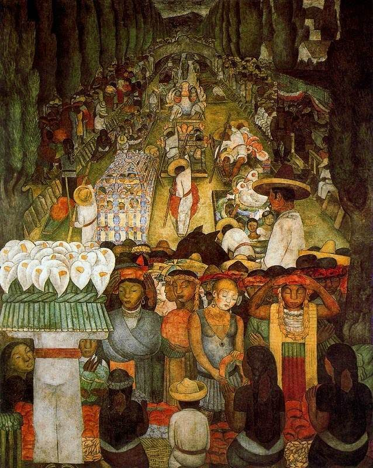

[🏠 Home](../../index.md)

# August 6

## 🧑‍🎨 Painting of the day

[Diego Rivera](http://en.wikipedia.org/wiki/Diego_Rivera) (Social Realism, Muralism)

<button class="btn btn-success"
onclick=" window.open('https://lens.google.com/uploadbyurl?url=https://iretes.github.io/one-a-day/data/img/Diego_Rivera_4.jpg','_blank')">
Search with Google Lens
</button>

## 🎼 Song of the day

> *Just Like a Woman*
by Bob Dylan

 Written by Dylan.

Released in May , 1966.

<button class="btn btn-success"
onclick=" window.open('http://www.youtube.com/search?q=Just Like a Woman by Bob Dylan','_blank')">
Search on YouTube
</button>

## 🏛️ UNESCO heritage site of the day

> *Rock-Hewn Churches, Lalibela*, Ethiopia

The 11 medieval monolithic cave churches of this 13th-century 'New Jerusalem' are situated in a mountainous region in the heart of Ethiopia near a traditional village with circular-shaped dwellings. Lalibela is a high place of Ethiopian Christianity, still today a place of pilmigrage and devotion.

<button class="btn btn-success"
onclick=" window.open('http://www.google.com/search?q=Rock-Hewn Churches, Lalibela','_blank')">
Search on Google
</button>

## 🗺️ Place of the day

<iframe
src="https://www.mapcrunch.com"
name="mapcrunch"
width="500"
height="500"
allowTransparency="true"
scrolling="no"
frameborder="0"
>
</iframe>
## 🎨 Color of the day

> *[Magenta](https://en.wikipedia.org/wiki/Magenta)*

&#9632;

## 🌿 Plant of the day

> *mesquite*

<button class="btn btn-success"
onclick=" window.open('http://www.google.com/search?q=mesquite','_blank')">
Search on Google
</button>

## 🧑‍🔬 Scientific discovery of the day

> *11th century: Alhazen discovers the formula for the simplicial numbers defined as the sums of consecutive quartic powers.*

<button class="btn btn-success"
onclick=" window.open('http://www.google.com/search?q=11th century: Alhazen discovers the formula for the simplicial numbers defined as the sums of consecutive quartic powers.','_blank')"> 
Search on Google
</button>

## 💭 Philosophical concept of the day

> *[Cogito ergo sum](https://en.wikipedia.org/wiki/Cogito_ergo_sum)*

## 🗣️ Saying of the day

> *Many a true word is spoken in jest*

A literal meaning; that the truth is often found in comic utterances.
