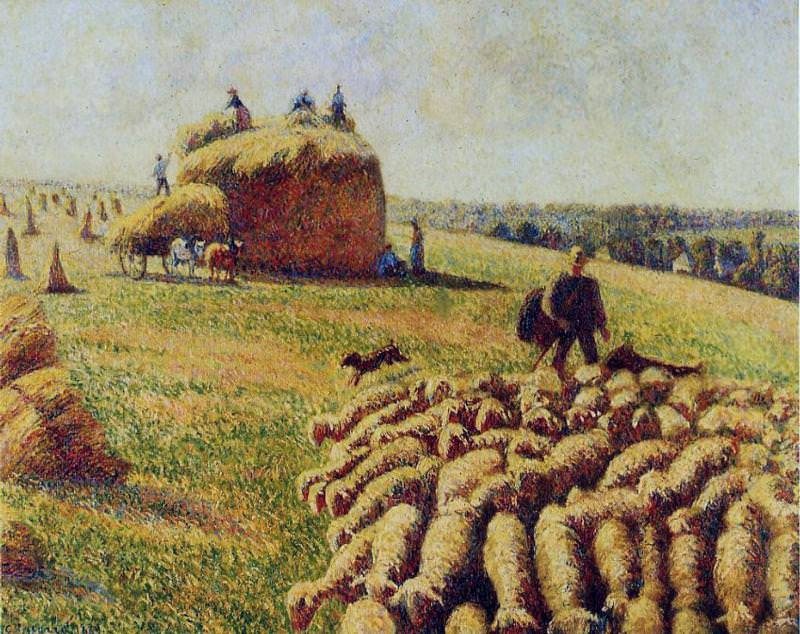

[🏠 Home](../../index.md)

# August 7

## 🧑‍🎨 Painting of the day

[Camille Pissarro](https://en.wikipedia.org/wiki/Camille_Pissarro) (Impressionism, Post-Impressionism)

<button class="btn btn-success"
onclick=" window.open('https://lens.google.com/uploadbyurl?url=https://iretes.github.io/one-a-day/data/img/Camille_Pissarro_5.jpg','_blank')">
Search with Google Lens
</button>

## 🎼 Song of the day

> *Moondance*
by Van Morrison

 Written by Morrison.

Released in Feb. , 1970.

<button class="btn btn-success"
onclick=" window.open('http://www.youtube.com/search?q=Moondance by Van Morrison','_blank')">
Search on YouTube
</button>

## 🏛️ UNESCO heritage site of the day

> *Engelsberg Ironworks*, Sweden

Sweden's production of superior grades of iron made it a leader in this field in the 17th and 18th centuries. This site is the best-preserved and most complete example of this type of Swedish ironworks.

<button class="btn btn-success"
onclick=" window.open('http://www.google.com/search?q=Engelsberg Ironworks','_blank')">
Search on Google
</button>

## 🗺️ Place of the day

<iframe
src="https://www.mapcrunch.com"
name="mapcrunch"
width="500"
height="500"
allowTransparency="true"
scrolling="no"
frameborder="0"
>
</iframe>
## 🎨 Color of the day

> *[Metallic Seaweed](https://en.wikipedia.org/wiki/List_of_Crayola_crayon_colors#Metallic_FX)*

&#9632;

## 🌿 Plant of the day

> *mossycup white oak*

<button class="btn btn-success"
onclick=" window.open('http://www.google.com/search?q=mossycup white oak','_blank')">
Search on Google
</button>

## 🧑‍🔬 Scientific discovery of the day

> *3rd century BC: Pingala in Mauryan India studies binary numbers, making him the first to study the radix (numerical base) in history.*

<button class="btn btn-success"
onclick=" window.open('http://www.google.com/search?q=3rd century BC: Pingala in Mauryan India studies binary numbers, making him the first to study the radix (numerical base) in history.','_blank')">
Search on Google
</button>

## 💭 Philosophical concept of the day

> *[Cartesian Other](https://en.wikipedia.org/wiki/Cartesian_Other)*

## 🗣️ Saying of the day

> *My bad *

My mistake - I'm to blame. 
