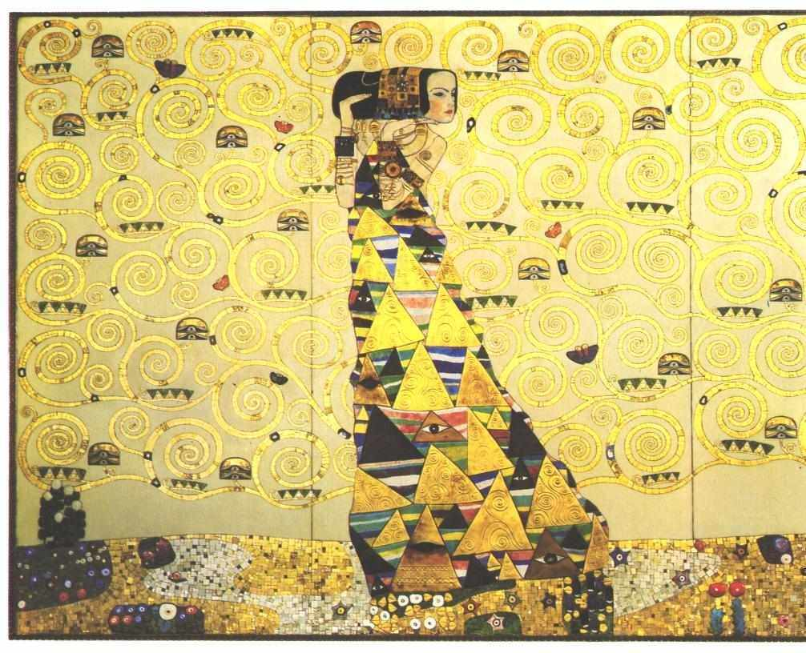

[🏠 Home](../../index.md)

# August 8

## 🧑‍🎨 Painting of the day

[Gustav Klimt](http://en.wikipedia.org/wiki/Gustav_Klimt) (Symbolism, Art Nouveau)

<button class="btn btn-success"
onclick=" window.open('https://lens.google.com/uploadbyurl?url=https://iretes.github.io/one-a-day/data/img/Gustav_Klimt_4.jpg','_blank')">
Search with Google Lens
</button>

## 🎼 Song of the day

> *Mannish Boy*
by Muddy Waters

 Written by McKinley Morganfield, Mel London, Ellas McDaniel.

Released in May , 1955.

<button class="btn btn-success"
onclick=" window.open('http://www.youtube.com/search?q=Mannish Boy by Muddy Waters','_blank')">
Search on YouTube
</button>

## 🏛️ UNESCO heritage site of the day

> *Lines and Geoglyphs of Nasca and Palpa*, Peru

Located in the arid Peruvian coastal plain, some 400 km south of Lima, the geoglyphs of Nasca and the pampas of Jumana cover about 450 km2 . These lines, which were scratched on the surface of the ground between 500 B.C. and A.D. 500, are among archaeology's greatest enigmas because of their quantity, nature, size and continuity. The geoglyphs depict living creatures, stylized plants and imaginary beings, as well as geometric figures several kilometres long. They are believed to have had ritual astronomical functions.

<button class="btn btn-success"
onclick=" window.open('http://www.google.com/search?q=Lines and Geoglyphs of Nasca and Palpa','_blank')">
Search on Google
</button>

## 🗺️ Place of the day

<iframe
src="https://www.mapcrunch.com"
name="mapcrunch"
width="500"
height="500"
allowTransparency="true"
scrolling="no"
frameborder="0"
>
</iframe>
## 🎨 Color of the day

> *[Orange-yellow](https://en.wikipedia.org/wiki/Marigold_(color)#Orange-yellow)*

&#9632;

## 🌿 Plant of the day

> *wild hops*

<button class="btn btn-success"
onclick=" window.open('http://www.google.com/search?q=wild hops','_blank')">
Search on Google
</button>

## 🧑‍🔬 Scientific discovery of the day

> *1934: Enrico Fermi: Nuclear fission by neutron irradiation*

<button class="btn btn-success"
onclick=" window.open('http://www.google.com/search?q=1934: Enrico Fermi: Nuclear fission by neutron irradiation','_blank')">
Search on Google
</button>

## 💭 Philosophical concept of the day

> *[Compossibility](https://en.wikipedia.org/wiki/Compossibility)*

## 🗣️ Saying of the day

> *Big fish in a small pond - A*

Someone who is important but only within a limited area of influence.
