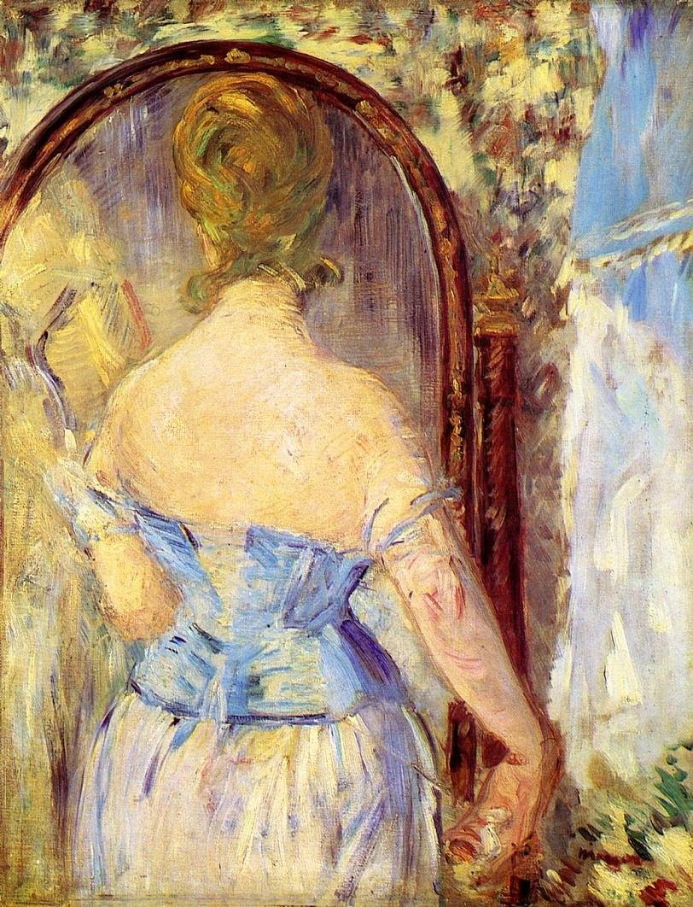

[🏠 Home](../../index.md)

# August 9

## 🧑‍🎨 Painting of the day

[Edouard Manet](http://en.wikipedia.org/wiki/Édouard_Manet) (Realism, Impressionism)

<button class="btn btn-success"
onclick=" window.open('https://lens.google.com/uploadbyurl?url=https://iretes.github.io/one-a-day/data/img/Edouard_Manet_5.jpg','_blank')">
Search with Google Lens
</button>

## 🎼 Song of the day

> *Good Times*
by Chic

 Written by Nile Rodgers, Bernard Edwards.

Released in June , 1979.

<button class="btn btn-success"
onclick=" window.open('http://www.youtube.com/search?q=Good Times by Chic','_blank')">
Search on YouTube
</button>

## 🏛️ UNESCO heritage site of the day

> *Historic Monuments of Ancient Nara*, Japan

Nara was the capital of Japan from 710 to 784. During this period the framework of national government was consolidated and Nara enjoyed great prosperity, emerging as the fountainhead of Japanese culture. The city's historic monuments – Buddhist temples, Shinto shrines and the excavated remains of the great Imperial Palace – provide a vivid picture of life in the Japanese capital in the 8th century, a period of profound political and cultural change.

<button class="btn btn-success"
onclick=" window.open('http://www.google.com/search?q=Historic Monuments of Ancient Nara','_blank')">
Search on Google
</button>

## 🗺️ Place of the day

<iframe
src="https://www.mapcrunch.com"
name="mapcrunch"
width="500"
height="500"
allowTransparency="true"
scrolling="no"
frameborder="0"
>
</iframe>
## 🎨 Color of the day

> *[Gotham green](https://en.wikipedia.org/wiki/Spring_green#Gotham_green)*

&#9632;

## 🌿 Plant of the day

> *hedge plant*

<button class="btn btn-success"
onclick=" window.open('http://www.google.com/search?q=hedge plant','_blank')">
Search on Google
</button>

## 🧑‍🔬 Scientific discovery of the day

> *1880s: John Hopkinson develops three-phase electrical supplies, mathematically proves how multiple AC dynamos can be connected in parallel, improves permanent magnets, and dynamo efficiency, by the addition of tungsten, and describes how temperature effects magnetism (Hopkinson effect).*

<button class="btn btn-success"
onclick=" window.open('http://www.google.com/search?q=1880s: John Hopkinson develops three-phase electrical supplies, mathematically proves how multiple AC dynamos can be connected in parallel, improves permanent magnets, and dynamo efficiency, by the addition of tungsten, and describes how temperature effects magnetism (Hopkinson effect).','_blank')">
Search on Google
</button>

## 💭 Philosophical concept of the day

> *[Agathusia and aschimothusia](https://en.wikipedia.org/wiki/Agathusia_and_aschimothusia)*

## 🗣️ Saying of the day

> *Ask a silly question and you'll get a silly answer*

Literal meaning.

## 🏳️‍🌈 International day

International Day of the World's Indigenous Peoples.