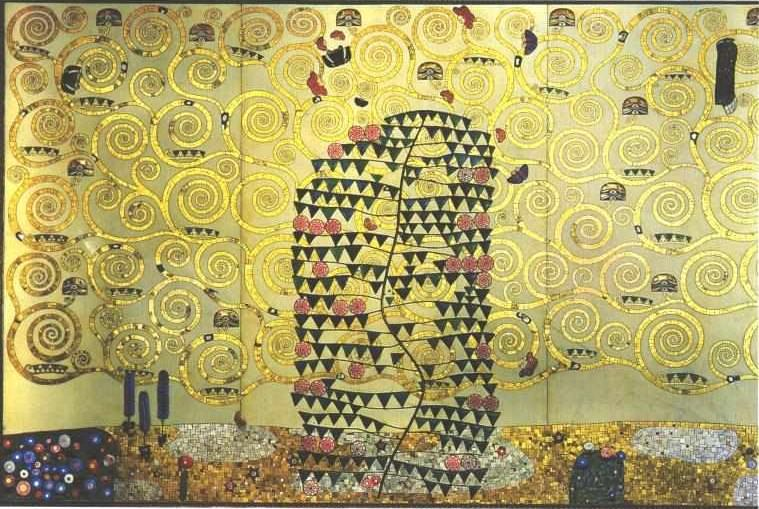

[🏠 Home](../../index.md)

# December 1

## 🧑‍🎨 Painting of the day

[Gustav Klimt](http://en.wikipedia.org/wiki/Gustav_Klimt) (Symbolism, Art Nouveau)

<button class="btn btn-success"
onclick=" window.open('https://lens.google.com/uploadbyurl?url=https://iretes.github.io/one-a-day/data/img/Gustav_Klimt_3.jpg','_blank')">
Search with Google Lens
</button>

## 🎼 Song of the day

> *Lonely Teardrops*
by Jackie Wilson

 Written by Berry Gordy, Gwen Gordy, Tyran Carlo.

Released in Nov. , 1958.

<button class="btn btn-success"
onclick=" window.open('http://www.youtube.com/search?q=Lonely Teardrops by Jackie Wilson','_blank')">
Search on YouTube
</button>

## 🏛️ UNESCO heritage site of the day

> *Ruins of Kilwa Kisiwani and Ruins of Songo Mnara*, United Republic of Tanzania

The remains of two great East African ports admired by early European explorers are situated on two small islands near the coast. From the 13th to the 16th century, the merchants of Kilwa dealt in gold, silver, pearls, perfumes, Arabian crockery, Persian earthenware and Chinese porcelain; much of the trade in the Indian Ocean thus passed through their hands.

<button class="btn btn-success"
onclick=" window.open('http://www.google.com/search?q=Ruins of Kilwa Kisiwani and Ruins of Songo Mnara','_blank')">
Search on Google
</button>

## 🗺️ Place of the day

<iframe
src="https://www.mapcrunch.com"
name="mapcrunch"
width="500"
height="500"
allowTransparency="true"
scrolling="no"
frameborder="0"
>
</iframe>
## 🎨 Color of the day

> *[Shiny Shamrock](https://en.wikipedia.org/wiki/List_of_Crayola_crayon_colors#Silver_Swirls)*

&#9632;

## 🌿 Plant of the day

> *soldiers woundwort*

<button class="btn btn-success"
onclick=" window.open('http://www.google.com/search?q=soldiers woundwort','_blank')">
Search on Google
</button>

## 🧑‍🔬 Scientific discovery of the day

> *1977: Frederick Sanger sequences the first DNA genome of an organism using Sanger sequencing*

<button class="btn btn-success"
onclick=" window.open('http://www.google.com/search?q=1977: Frederick Sanger sequences the first DNA genome of an organism using Sanger sequencing','_blank')"> 
Search on Google
</button>

## 💭 Philosophical concept of the day

> *[Perception](https://en.wikipedia.org/wiki/Perception)*

## 🗣️ Saying of the day

> *Better half *

My husband or my wife. 

## 🏳️‍🌈 International day

World AIDS Day.