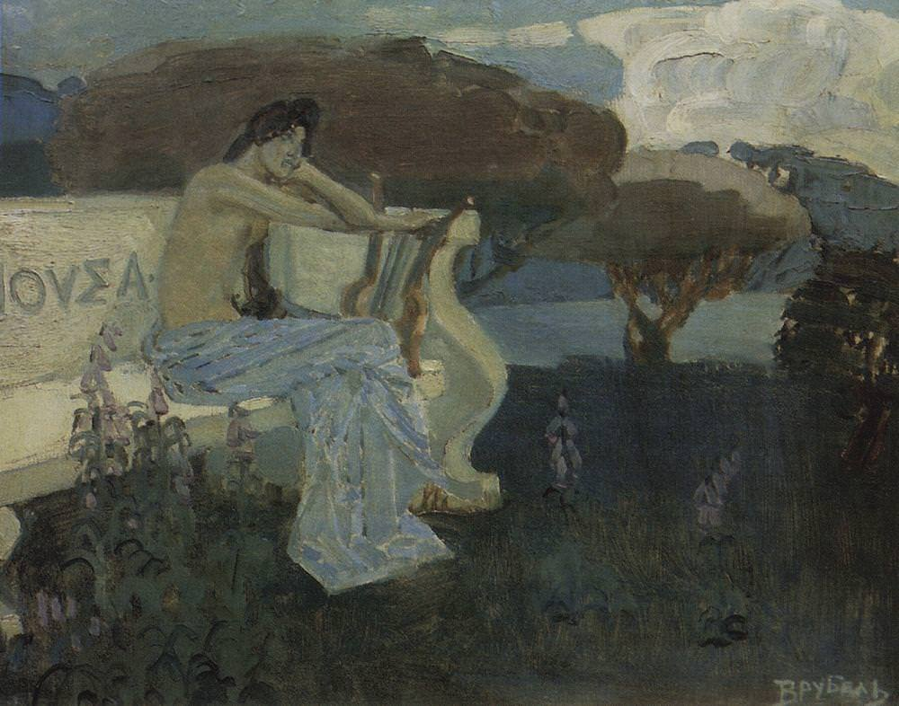

[🏠 Home](../../index.md)

# December 10

## 🧑‍🎨 Painting of the day

[Mikhail Vrubel](http://en.wikipedia.org/wiki/Mikhail_Vrubel) (Symbolism)

<button class="btn btn-success"
onclick=" window.open('https://lens.google.com/uploadbyurl?url=https://iretes.github.io/one-a-day/data/img/Mikhail_Vrubel_3.jpg','_blank')">
Search with Google Lens
</button>

## 🎼 Song of the day

> *Like A Prayer*
by Madonna

 Written by Madonna, Patrick Leonard.

Released in March , 1989.

<button class="btn btn-success"
onclick=" window.open('http://www.youtube.com/search?q=Like A Prayer by Madonna','_blank')">
Search on YouTube
</button>

## 🏛️ UNESCO heritage site of the day

> *The Dolomites*, Italy

The site of the Dolomites comprises a mountain range in the northern Italian Alps, numbering 18 peaks which rise to above 3,000 metres and cover 141,903 ha. It features some of the most beautiful mountain landscapes anywhere, with vertical walls, sheer cliffs and a high density of narrow, deep and long valleys. A serial property of nine areas that present a diversity of spectacular landscapes of international significance for geomorphology marked by steeples, pinnacles and rock walls, the site also contains glacial landforms and karst systems. It is characterized by dynamic processes with frequent landslides, floods and avalanches. The property also features one of the best examples of the preservation of Mesozoic carbonate platform systems, with fossil records.

<button class="btn btn-success"
onclick=" window.open('http://www.google.com/search?q=The Dolomites','_blank')">
Search on Google
</button>

## 🗺️ Place of the day

<iframe
src="https://www.mapcrunch.com"
name="mapcrunch"
width="500"
height="500"
allowTransparency="true"
scrolling="no"
frameborder="0"
>
</iframe>
## 🎨 Color of the day

> *[Green (NCS)](https://en.wikipedia.org/wiki/Shades_of_green#Green_(NCS)_(psychological_primary_green))*

&#9632;

## 🌿 Plant of the day

> *maize*

<button class="btn btn-success"
onclick=" window.open('http://www.google.com/search?q=maize','_blank')">
Search on Google
</button>

## 🧑‍🔬 Scientific discovery of the day

> *1920: Arthur Eddington: Stellar nucleosynthesis*

<button class="btn btn-success"
onclick=" window.open('http://www.google.com/search?q=1920: Arthur Eddington: Stellar nucleosynthesis','_blank')">
Search on Google
</button>

## 💭 Philosophical concept of the day

> *[The Golden Rule](https://en.wikipedia.org/wiki/The_Golden_Rule)*

## 🗣️ Saying of the day

> *Chance would be a fine thing*

There is not much chance of that [thing], welcome though it would be. 

## 🏳️‍🌈 International day

Human Rights Day.