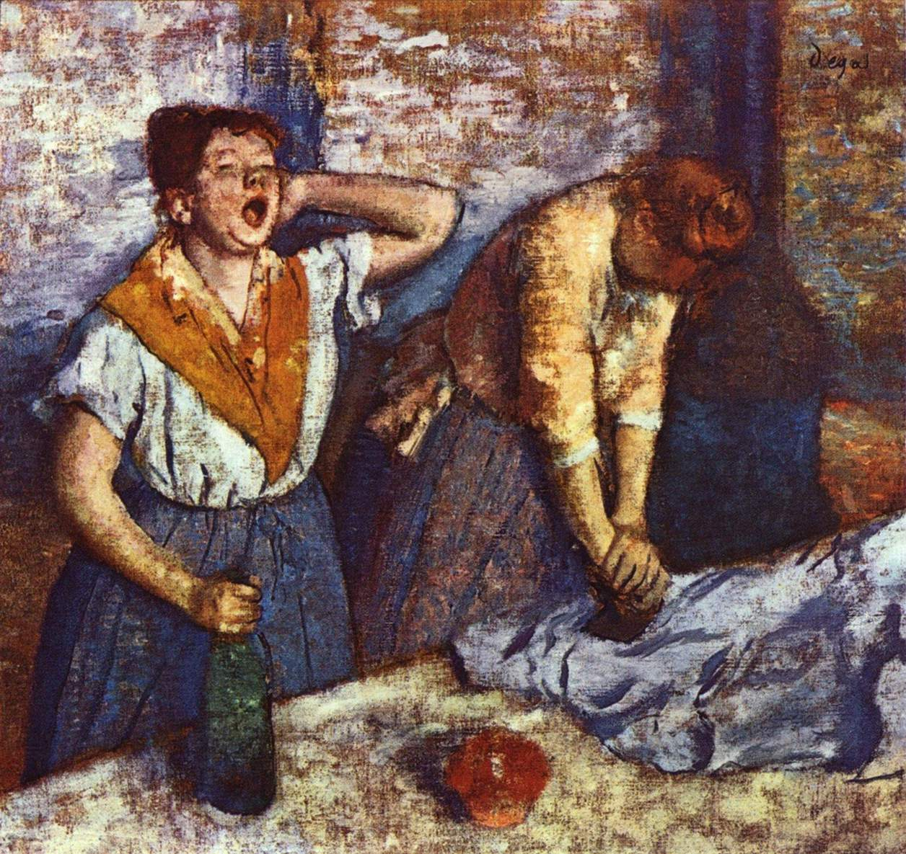

[🏠 Home](../../index.md)

# December 11

## 🧑‍🎨 Painting of the day

[Edgar Degas](http://en.wikipedia.org/wiki/Edgar_Degas) (Impressionism)

<button class="btn btn-success"
onclick=" window.open('https://lens.google.com/uploadbyurl?url=https://iretes.github.io/one-a-day/data/img/Edgar_Degas_1.jpg','_blank')">
Search with Google Lens
</button>

## 🎼 Song of the day

> *One Way or Another*
by Blondie

 Written by Deborah Harry, Nigel Harrison.

Released in Sept. , 1978.

<button class="btn btn-success"
onclick=" window.open('http://www.youtube.com/search?q=One Way or Another by Blondie','_blank')">
Search on YouTube
</button>

## 🏛️ UNESCO heritage site of the day

> *Medina of Fez*, Morocco

Founded in the 9th century and home to the oldest university in the world, Fez reached its height in the 13th&ndash;14th centuries under the Marinids, when it replaced Marrakesh as the capital of the kingdom. The urban fabric and the principal monuments in the medina &ndash; <em>madrasas, fondouks</em>, palaces, residences, mosques and fountains - date from this period. Although the political capital of Morocco was transferred to Rabat in 1912, Fez has retained its status as the country's cultural and spiritual centre.

<button class="btn btn-success"
onclick=" window.open('http://www.google.com/search?q=Medina of Fez','_blank')">
Search on Google
</button>

## 🗺️ Place of the day

<iframe
src="https://www.mapcrunch.com"
name="mapcrunch"
width="500"
height="500"
allowTransparency="true"
scrolling="no"
frameborder="0"
>
</iframe>
## 🎨 Color of the day

> *[Fulvous](https://en.wikipedia.org/wiki/Fulvous)*

&#9632;

## 🌿 Plant of the day

> *fennel*

<button class="btn btn-success"
onclick=" window.open('http://www.google.com/search?q=fennel','_blank')">
Search on Google
</button>

## 🧑‍🔬 Scientific discovery of the day

> *1927: Werner Heisenberg: Uncertainty principle (Quantum mechanics)*

<button class="btn btn-success"
onclick=" window.open('http://www.google.com/search?q=1927: Werner Heisenberg: Uncertainty principle (Quantum mechanics)','_blank')"> 
Search on Google
</button>

## 💭 Philosophical concept of the day

> *[Reason](https://en.wikipedia.org/wiki/Reason)*

## 🗣️ Saying of the day

> *Veg out*

To 'veg out' is to relax in a slothful and mindless manner.

## 🏳️‍🌈 International day

International Mountain Day.