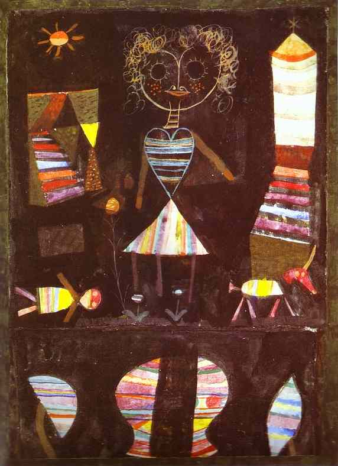

[🏠 Home](../../index.md)

# December 12

## 🧑‍🎨 Painting of the day

[Paul Klee](https://en.wikipedia.org/wiki/Paul_Klee) (Expressionism, Abstractionism, Surrealism)

<button class="btn btn-success"
onclick=" window.open('https://lens.google.com/uploadbyurl?url=https://iretes.github.io/one-a-day/data/img/Paul_Klee_2.jpg','_blank')">
Search with Google Lens
</button>

## 🎼 Song of the day

> *Sign O The Times*
by Prince

 Written by Prince.

Released in March , 1987.

<button class="btn btn-success"
onclick=" window.open('http://www.youtube.com/search?q=Sign O The Times by Prince','_blank')">
Search on YouTube
</button>

## 🏛️ UNESCO heritage site of the day

> *Huanglong Scenic and Historic Interest Area*, China

Situated in the north-west of Sichaun Province, the Huanglong valley is made up of snow-capped peaks and the easternmost of all the Chinese glaciers. In addition to its mountain landscape, diverse forest ecosystems can be found, as well as spectacular limestone formations, waterfalls and hot springs. The area also has a population of endangered animals, including the giant panda and the Sichuan golden snub-nosed monkey.

<button class="btn btn-success"
onclick=" window.open('http://www.google.com/search?q=Huanglong Scenic and Historic Interest Area','_blank')">
Search on Google
</button>

## 🗺️ Place of the day

<iframe
src="https://www.mapcrunch.com"
name="mapcrunch"
width="500"
height="500"
allowTransparency="true"
scrolling="no"
frameborder="0"
>
</iframe>
## 🎨 Color of the day

> *[Unmellow yellow](https://en.wikipedia.org/wiki/Shades_of_yellow#Unmellow_yellow)*

&#9632;

## 🌿 Plant of the day

> *yellow corydalis*

<button class="btn btn-success"
onclick=" window.open('http://www.google.com/search?q=yellow corydalis','_blank')">
Search on Google
</button>

## 🧑‍🔬 Scientific discovery of the day

> *1912: Vesto Slipher: galactic redshifts*

<button class="btn btn-success"
onclick=" window.open('http://www.google.com/search?q=1912: Vesto Slipher: galactic redshifts','_blank')"> 
Search on Google
</button>

## 💭 Philosophical concept of the day

> *[Panopticon](https://en.wikipedia.org/wiki/Panopticon)*

## 🗣️ Saying of the day

> *Got my mojo working*

My magic charm is working.

## 🏳️‍🌈 International day

International Day of Neutrality, International Universal Health Coverage Day.